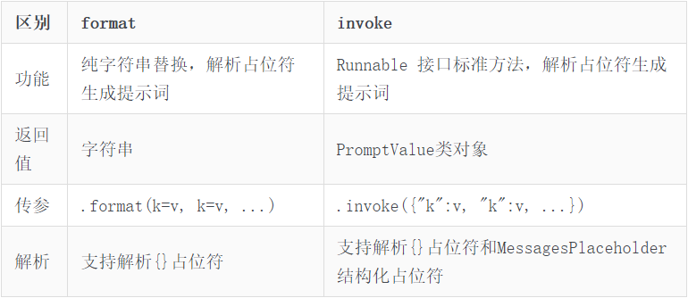
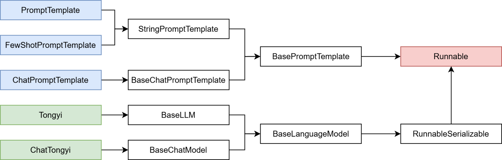
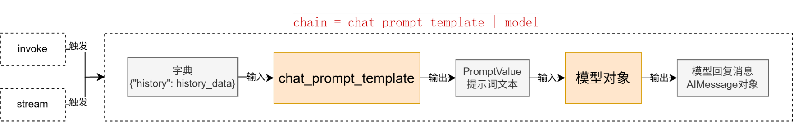

# LangChain
[官方文档](https://reference.langchain.com/python/langchain)

## 简介
LangChain模型组件提供了与各种模型的集成，并为所有模型提供一个精简的统一接口。它作为一个“工具”，不提供任何LLMs，而是依赖于第三方集成的各种大模型。如OpenAI、Anthropic、Hugging Face、LlaMA、阿里Qwen、ChatGLM等平台的模型无缝接入你的应用。     
LangChain目前支持三种类型的模型：LLMs（大语言模型）、Chat Models(聊天模型)、Embeddings Models(嵌入模型）.

* LLMs:是技术范畴的统称，指基于大参数量、海量文本训练的 Transformer 架构模型，核心能力是理解和生成自然语言，主要服务于文本生成场景
* 聊天模型:是应用范畴的细分，是专为对话场景优化的 LLMs，核心能力是模拟人类对话的轮次交互，主要服务于聊天场景
* 文本嵌入模型: 文本嵌入模型接收文本作为输入, 得到文本的向量.

LangChain支持的三类模型，它们的使用场景不同，输入和输出不同，开发者需要根据项目需要选择相应。


## 安装部署
这里只介绍学习过程中需要的一些库
* langchain：核心包    
* langchain-community：社区支持包，提供了更多的第三方模型调用（我们用的阿里云千问模型就需要这个包）   
* langchain-ollama：Ollama支持包，支持调用Ollama托管部署的本地模型
* langchain-chroma：ChromaDB支持包，支持调用ChromaDB
* dashscope：阿里云通义千问的Python SDK
* chromadb：轻量向量数据库（后续使用）
* bs4：BeautifulSqop4库，协助解析HTML文档（后续学习文档加载器使用）
## 模型调用的分类
角度1、按照模型功能的不同
* 非对话模型（LLMs、Text Model）
* 对话模型（Chat Models）      **（推荐）**
* 嵌入模型（Embeddings Models）

角度2、模型调用时，几个重要参数书写的位置的不同
* 硬编码：写在代码文件中
* 使用环境变量
* 使用配置文件   **（推荐）**

角度3、具体API的调用
* OpenAI提供的API
* 其他大模型自家提供的API    
* LangChain的统一方式调用API   **（推荐）**


## 大语言模型调用方式
### 硬编码方式
```
from langchain_openai import ChatOpenAI

#获取对话模型
chat_model = ChatOpenAI(
    #必要的三个参数
    model="qwen-max", 
    base_url="https://dashscope.aliyuncs.com/compatible-mode/v1",
    api_key="sk-e2efd0...")

#调用模型
response = chat_model.invoke("请介绍一下你自己")
#查看响应的文本
print(response)
```
输出：
```
content='您好，我是Qwen，这是我的英文名，您也可以叫我通义千问。我是阿里云自主研发的超大规模语言模型，能够回答问题、创作文字，还能表达观点、撰写代码。如果您有任何问题或需要帮助，请随时告诉我，我会尽力提供支持。' additional_kwargs={'refusal': None} response_metadata={'token_usage': {'completion_tokens': 58, 'prompt_tokens': 11, 'total_tokens': 69, 'completion_tokens_details': None, 'prompt_tokens_details': {'audio_tokens': None, 'cached_tokens': 0}}, 'model_name': 'qwen-max', 'system_fingerprint': None, 'finish_reason': 'stop', 'logprobs': None} id='run--ccc18076-fc34-4153-8efd-3fee0f2476cb-0' usage_metadata={'input_tokens': 11, 'output_tokens': 58, 'total_tokens': 69}
```
### 使用环境变量方式
使用环境变量的方法，在jupyter中执行不合适，需要在.py文件中执行。只适合当前环境，如果切换环境则还需更改。     
直接在电脑高级系统设置中，在用户环境变量中添加**变量名+变量值**，例如OPENAI_API_KEY用于openai库，DASHSCOPE_API_KEY用于langchain库，第一次添加后要重启电脑。  

```
from langchain_openai import ChatOpenAI
import os

#获取对话模型
chat_model = ChatOpenAI(
    #必要的三个参数
    model="gpt-3.5-turbo", 
    base_url=os.environ["OPENAI_BASE_URL"],
    api_key=os.environ["OPENAI_API_KEY"])

#调用模型
response = chat_model.invoke("请介绍一下你自己")
#查看响应的文本
print(response)
```

### 使用配置文件方式
配置.env文件，当前目录下新建一个名为.env的文件，其中包含需要的配置信息：
```
aliyun_api_key="a463289e14...."
aliyun_base_url="https://..."
TAVILY_API_KEY="tvly..."
```
方法1、
```
from langchain_openai import ChatOpenAI
import os 
import dotenv


#获取对话模型
chat_model = ChatOpenAI(
    #必要的三个参数
    model="qwen-max", 
    base_url=os.getenv("aliyun_base_url"),
    api_key=os.getenv("aliyun_api_key"),
    )

#调用模型
response = chat_model.invoke("请介绍一下你自己")
#查看响应的文本
print(response)
```
方法2、
```
from langchain_openai import ChatOpenAI
import os 
import dotenv


#加载配置文件
dotenv.load_dotenv()
os.environ["OPENAI_BASE_URL"] = os.getenv("aliyun_base_url")
os.environ["OPENAI_API_KEY"] = os.getenv("aliyun_api_key")
#获取对话模型
chat_model = ChatOpenAI(
    #必要的三个参数
    #model_name="gpt-4o-mini"，默认使用的是该模型
    #当没有显示的声明base_url、api_key时，默认从环境变量中查找
    model="qwen-max",
    )

#调用模型
response = chat_model.invoke("请介绍一下你自己")
#查看响应的文本
print(response)
```


## LLMs
### 直接返回结果
LLMs使用场景最多，常用大模型的下载库：   
https://huggingface.co/models    
https://modelscope.cn/models    
同时LangChain支持对许多模型的调用，以通义千问为例：
```
import os
import dotenv
dotenv.load_dotenv()   

from langchain_community.llms.tongyi import Tongyi  
model = Tongyi(
    model="qwen-plus",
    api_key=os.getenv("aliyun_api_key"),
)

res = model.invoke("你是谁, 能做什么？")
print(res)
```
如果要访问本地ollama，通过langchain_ollama包导入OllamaLLM类即可：
```
from langchain_ollama import OllamaLLM
model = OllamaLLM(model="qwen3.5:0.8b")  
res = model.invoke("你是谁, 能做什么？")
print(res)
```
### 流式输出
如果需要流式输出结果，需要将模型的invoke方法改为stream方法即可。
* invoke方法：一次型返回完整结果
* stream方法：逐段返回结果，流式输出

这两个方法是新版LangChain(1.0版本后)中基于Runnable接口的通用核心方法。绝大多数组件（如提示词模板、链、向量检索、工具调用等）都支持这两个方法，这也是 LangChain 设计的核心统一范式。
```
import os
import dotenv
from langchain_community.llms.tongyi import Tongyi 
dotenv.load_dotenv()  

 
model = Tongyi(
    # 不用qwen3-max，因为qwen3-max是聊天模型，qwen-max是大语言模型
    model="qwen-max",
    api_key=os.getenv("aliyun_api_key"),
)
# 通过stream方法获得流式输出
res = model.stream("你是谁, 能做什么？")
for chunk in res:
    print(chunk,end="", flush=True)
```

## Chat Models（对话模型）
聊天消息包含下面几种类型，使用时需要按照约定传入合适的值：

* AIMessage: 就是 AI 输出的消息，可以是针对问题的回答. (OpenAI库中的assistant角色）
* HumanMessage: 人类消息就是用户信息，由人给出的信息发送给LLMs的提示信息，比如“实现一个快速排序方法”. (OpenAI库中的user角色）
* SystemMessage: 可以用于指定模型具体所处的环境和背景，如角色扮演等。你可以在这里给出具体的指示，比如“作为一个代码专家”，或者“返回json格式”. (OpenAI库中的system角色）

```
import os 
import dotenv

#加载配置文件
dotenv.load_dotenv()
os.environ["DASHSCOPE_BASE_URL"] = os.getenv("aliyun_base_url")
os.environ["DASHSCOPE_API_KEY"] = os.getenv("aliyun_api_key")
```
1、单独使用演示  HumanMessage 
```
from langchain_community.chat_models.tongyi import ChatTongyi
from langchain_core.messages import HumanMessage
# 初始化模型
chat = ChatTongyi(model="qwen3-max")
#  准备消息list
messages = [
    HumanMessage(content="给我写一首唐诗")
]
# 流式输出
for chunk in chat.stream(input=messages):
    print(chunk.content, end="", flush=True)
```
输出：
```
好的，这是一首模仿盛唐气象创作的七言绝句，题为《塞上闻笛》：

**《塞上闻笛》**
**玉门霜落月如钩，**
**铁马冰河夜戍楼。**
**忽听胡笳声裂帛，**
**万山烽火一时收。**
......
```
2、SystemMessage + HumanMessage
```
from langchain_community.chat_models.tongyi import ChatTongyi
from langchain_core.messages import HumanMessage, SystemMessage
# 初始化模型
chat = ChatTongyi(model="qwen3-max")
# 准备消息list
messages = [
        SystemMessage(content="你是一名来自边塞的诗人"),  
        HumanMessage(content="给我写一首唐诗")
        ]
# 流式输出
for chunk in chat.stream(input=messages):
    print(chunk.content, end="", flush=True) 
```
3、SystemMessage + HumanMessage + AIMessage
```
from langchain_community.chat_models.tongyi import ChatTongyi
from langchain_core.messages import HumanMessage, SystemMessage, AIMessage
# 初始化模型
chat = ChatTongyi(model="qwen3-max")
# 准备消息list
messages = [
        SystemMessage(content="你是一名来自边塞的诗人"),
        HumanMessage(content="给我写一首唐诗"),
        AIMessage(content="锄禾日当午，汗滴禾下土，谁知盘中餐，粒粒皆辛苦。"),   #ai回复的消息
        HumanMessage(content="按照你上一首回复的格式，再来一首")
        ]
# 流式输出
for chunk in chat.stream(input=messages):
    print(chunk.content, end="", flush=True) 
```
**Message简写形式**

通过2元元组封装信息:
* 第一个元素为角色
  * 字符串：system/human/ai
* 第二个元素为内容
```
messages = [
        ("system", "你是一个边塞诗人。"),
        ("human", "写一首唐诗"),
        ("ai", "锄禾日当午，汗滴禾下土，谁知盘中餐，粒粒皆辛苦。"),
        ("human", "按照你上一个回复的格式，再写一首唐诗。")
    ]
```

区别和优势在于，使用类对象的方式，如下：

1、是静态的，一步到位，直接就得到了Message类的类对象
```
messages = [
        SystemMessage(content="你是一名来自边塞的诗人"),
        HumanMessage(content="给我写一首唐诗"),
        AIMessage(content="锄禾日当午，汗滴禾下土，谁知盘中餐，粒粒皆辛苦。"),   #ai回复的消息
        HumanMessage(content="按照你上一首回复的格式，再来一首")
        ]
```
2、是动态的，需要在运行时，由LangChain内部机制转换为Message类对象
```
messages = [
        ("system", "你是一个边塞诗人。"),
        ("human", "写一首唐诗"),
        ("ai", "锄禾日当午，汗滴禾下土，谁知盘中餐，粒粒皆辛苦。"),
        ("human", "按照你上一个回复的格式，再写一首唐诗。")
    ]
```
3、好处就在于，简写形式避免导包、写起来更简单，更重要的是支持。
由于是动态，需要转换步骤
所以简写形式支持内部填充{变量}占位
可在运行时填充具体值(后续学习提示词模板时用到）
```
messages = [
        (“system”, “今天的天气是{weather}”),
        (“human”, “我的名字是：{name}”),
        (“ai”, “欢迎{lastname}先生"),
    ]
```
## Embeddings Models（嵌入模型）

Embeddings Models嵌入模型的特点：将字符串作为输入，返回一个浮点数的列表（向量）。    
在NLP中，Embedding的作用就是将数据进行文本向量化。

1、阿里云千问模型访问方式：
```
from langchain_community.embeddings import DashScopeEmbeddings
# 初始化嵌入模型对象，其默认使用模型是：text-embedding-v1
embed = DashScopeEmbeddings()
# 单次转换
print(embed.embed_query("我喜欢你"))    
# 批量转换
print(embed.embed_documents(['我喜欢你', '我稀饭你', '晚上吃啥'])) 
```
输出：
```
[-3.02587890625, 3.3109374046325684, 4.410546779632568,...]
[[-2.075488328933716, -2.4903321266174316,...],[...],[...]]
```
2、本地ollama

通过langchain_ollama导入OllamaEmbeddings使用，其余不变。
```
from langchain_ollama import OllamaEmbeddings
# 初始化嵌入模型对象，其默认使用模型是：text-embedding-v1
embed = OllamaEmbeddings(model="qwen3-embedding")
# 测试
print(embed.embed_query("我喜欢你"))   
print(embed.embed_documents(['我喜欢你', '我稀饭你', '晚上吃啥']))
```

## 通用prompt（zero-shot）
提示词优化在模型应用中非常重要，LangChain提供了PromptTemplate类，用来协助优化提示词。   
PromptTemplate表示提示词模板，可以构建一个自定义的基础提示词模板，支持变量的注入，最终生成所需的提示词。
1、标准写法
```
from langchain_core.prompts import PromptTemplate
from langchain_community.llms.tongyi import Tongyi
prompt_template = PromptTemplate.from_template(
        "我的邻居姓{lastname}, 刚生了{gender}, 帮忙起名字，请简略回答。"
    )
# 变量注入，生成提示词文本
prompt_text = prompt_template.format(lastname="张", gender="女儿")
model = Tongyi(model="qwen-max")        # 创建模型对象
res = model.invoke(input=prompt_text)   # 调用模型获取结果print(res)
```

2、基于chain链的写法
```
from langchain_core.prompts import PromptTemplate
from langchain_community.llms.tongyi import Tongyi
prompt_template = PromptTemplate.from_template(
        "我的邻居姓{lastname}, 刚生了{gender}, 帮忙起名字，请简略回答。"
    )
model = Tongyi(model="qwen-max")        # 创建模型对象
# 生成链
chain = prompt_template | model
# 基于链，调用模型获取结果
res = chain.invoke(input={"lastname": "曹", "gender": "女儿"})
print(res)
```
输出：
```
曹欣怡
```
## FewShotPromptTemplate
```
from langchain_core.prompts import FewShotPromptTemplate
FewShotPromptTemplate(
    examples=None,
    example_prompt=None,
    prefix=None,
    suffix=None,
    input_variables=None
)
```
参数：   
* examples：示例数据，list，内套字典
* example_prompt：示例数据的提示词模板
* prefix：组装提示词，示例数据前内容
* suffix：组装提示词，示例数据后内容
* input_variables：列表，声明在前缀或后缀中所需要注入的变量名
```
from langchain_core.prompts import FewShotPromptTemplate,PromptTemplate

example_template = PromptTemplate.from_template("单词:{word}, 反义词:{antonym}")

example_data = [       # 示例数据，list内套字典
    {"word": "大", "antonym": "小"},
    {"word": "上", "antonym": "下"}
]

few_shot_prompt = FewShotPromptTemplate(  # FewShot提示词模板对象
    example_prompt=example_template,
    examples=example_data,
    prefix="给出给定词的反义词，有如下示例：",
    suffix="基于示例告诉我：{input_word}的反义词是？",
    input_variables=['input_word']
)
# 获得最终提示词
prompt_text = few_shot_prompt.invoke(input={"input_word": "左"}).to_string()
# print(prompt_text)

model = ChatTongyi(model="qwen3-max")
for chunk in model.stream(input=prompt_text):
    print(chunk.content, end="", flush=True) 
```
输出：
```
word:左，antonym:右
```
**模板类的format和invoke方法区别：**  
PromptTemplate、FewShotPromptTemplate、ChatPromptTemplate等都拥有format和invoke这2类方法。


## ChatPromptTemplate
PromptTemplate：通用提示词模板，支持动态注入信息。   
FewShotPromptTemplate：支持基于模板注入任意数量的示例信息。   
ChatPromptTemplate：支持注入任意数量的历史会话信息。   

* 通过from_messages方法，从列表中获取多轮次会话作为聊天的基础模板   

（前面PromptTemplate类用的from_template仅能接入一条消息，而from_messages可以接入一个list的消息）


历史会话信息并不是静态的（固定的），而是随着对话的进行不停地积攒，即动态的。
所以，历史会话信息需要支持动态注入。
* MessagePlaceholder作为占位
* 提供history作为占位的key
* 基于invoke动态注入历史会话记录

必须是invoke，format无法注入。

示例：基于对话模型，组装聊天历史的模式，做提示词工程
```
from langchain_community.chat_models import ChatTongyi
from langchain_core.output_parsers import StrOutputParser
from langchain_core.prompts import ChatPromptTemplate, MessagesPlaceholder
from langchain_core.messages import HumanMessage, AIMessage
prompt = ChatPromptTemplate.from_messages(
    [
    ("system", "给出每个单词的反义词"),
    # 存储多轮对话的历史记录  history是占位符名称,后续从字典按history作为key取value替代内容
    MessagesPlaceholder("history"),
    ("human", "{question}")
    ]
)
model = ChatTongyi(model="qwen3-max")
# StrOutputParser() LangChain内置的结果解析器,可以直接提取结果文本内容,剔除其余元数据信息
chain = prompt | model | StrOutputParser()
# 无历史会话的提问
for chunk in chain.stream(input={"history": [], "question": "粗"}):
    print(chunk)
print("*"*20)
#带有历史的提问 用 HumanMessage（用户消息）和 AIMessage（模型消息）封装历史对话
history = [     # history 要求是一个列表,内部封装用户和AI的对话记录
    HumanMessage(content="开心"),  # 对应 ("human", "开心")
    AIMessage(content="难过"),    # 对应 ("ai", "难过")
    HumanMessage(content="高"),   # 对应 ("human", "高")
    AIMessage(content="矮")      # 对应 ("ai", "矮")
]
# 简化写法,元组的第一个元素是角色(标准角色名 human ai) 第二个元素是消息
# history = [
    #     ("human", "开心"), ("ai", "难过"),
    #     ("human", "高"), ("ai", "矮")
    # ]
for chunk in chain.stream(input={"history": history, "question": "粗"}):
    print(chunk)
```
输出：
```
“
粗”的反
义词是：细。


********************
细
```

## cahin链
「将组件串联，上一个组件的输出作为下一个组件的输入」是 LangChain 链（尤其是 | 管道链）的核心工作原理，这也是链式调用的核心价值：实现数据的自动化流转与组件的协同工作，如下。   
>chain = prompt_template | model

核心前提：即Runnable子类对象才能入链（以及Callable、Mapping接口子类对象也可加入）。      

我们目前所学习到的组件，均是Runnable接口的子类，如下类的继承关系：


```
from langchain_core.prompts import ChatPromptTemplate, MessagesPlaceholder
from langchain_community.chat_models.tongyi import ChatTongyi
from langchain_core.runnables.base import RunnableSerializable
chat_prompt_template = ChatPromptTemplate.from_messages(
    [
        ("system", "你是一个边塞诗人，可以作诗。"),
        MessagesPlaceholder("history"),
        ("human", "请再来一首唐诗，无需额外输出"),
    ]
)
history_data = [
    ("human", "你来写一个唐诗"),
    ("ai", "床前明月光，疑是地上霜，举头望明月，低头思故乡"),
    ("human", "好诗再来一个"),
    ("ai", "锄禾日当午，汗滴禾下锄，谁知盘中餐，粒粒皆辛苦"),
]
model = ChatTongyi(model="qwen3-max")

# 组成链，要求每个组件都是Runnable接口的子类
# 返回的chain是RunnableSerializable对象（也是Runnable接口的子类）
chain = chat_prompt_template | model
print(type(chain))

# Runnable接口，invoke执行
res = chain.invoke({"history": history_data})
print(res.content)

# Runnable接口，stream执行
for chunk in chain.stream({"history": history_data}):
    print(chunk.content, end="", flush=True)
```

* 通过|链接提示词模板对象和模型对象
* 返回值chain对象是RunnableSerializable对象
    * 是Runnable接口的直接子类
    * 也是绝大多数组件的父类
* 通过invoke或stream进行阻塞执行或流式执行

组成的链在执行上有：上一个组件的输出作为下一个组件的输入的特性。
所以有如下执行流程：



## StrOutputParser字符串输出解析器

如下代码，想要以第一次模型的输出结果，第二次去询问模型：
* 链的构建完全符合要求（参与的组件）
* 但是运行报错（ValueError: Invalid input type <class 'langchain_core.messages.ai.AIMessage'>. Must be a PromptValue, str, or list of BaseMessages.）

```
from langchain_core.prompts import PromptTemplate
from langchain_community.chat_models.tongyi import ChatTongyi

model = ChatTongyi(model="qwen3-max")
prompt = PromptTemplate.from_template(
    "我邻居姓：{lastname}, 刚生了{gender}，请起名，仅告知名字无需其它内容"
)
chain = prompt | model | model
res = chain.invoke({"lastname": "张", "gender": "女儿"})
print(res.content)
```
错误的主要原因是：
* prompt的结果是PromptValue类型，输入给了model
* model的输出结果是 AIMessage

而模型（ChatTongyi）源码中关于invoke方法明确指定了input的类型：   
>@override
def invoke(
    self,
    input: LanguageModelInput,
    config: RunnableConfig | None = None,
    *,
    stop: list[str] | None = None,
    **kwargs: Any,
) -> AIMessage:
 
LanguageModelInput = PromptValue | str | Sequence[MessageLikeRepresentation]
"""Input to a language model."""

所以需要做类型转换，可以借助LangChain内置的解析器:**StrOutputParser字符串输出解析器**

StrOutputParser是LangChain内置的简单字符串解析器   
* 可以将AIMessage解析为简单的字符串，符合了模型invoke方法要求（可传入字符串，不接收AIMessage类型）
* 是Runnable接口的子类（可以加入链）
>parser = StrOutputParser()   
chain = prompt | model | parser | model

## JsonOutputParser
>chain = prompt | model | parser | model | parser

在前面我们完成了这样的需求去构建多模型链，不过这种做法并不标准，因为：
上一个模型的输出，没有被处理就输入下一个模型。
正常情况下我们应该有如下处理逻辑：
>invoke｜stream 初始输入 -> 提示词模板 -> 模型 -> **数据处理** -> **提示词模板** -> 模型 -> 解析器 > 结果

即：上一个模型的输出结果，应该作为提示词模版的输入，构建下一个提示词，用来二次调用模型。

* 模型的输出为：AIMessage类对象   
* 提示词模板要求输入如下代码：
>def invoke(
    self, input: dict, config: RunnableConfig | None = None, **kwargs: Any
) -> PromptValue:

所以，我们需要完成：   
将模型输出的AIMessage -> 转为字典 -> 注入第二个提示词模板中，形成新的提示词（PromptValue对象）

>StrOutputParser不满足（AIMessage -> Str）       
更换为JsonOutputParser（AIMessage -> Dict(JSON)）

```
from langchain_core.output_parsers import StrOutputParser
from langchain_core.output_parsers import JsonOutputParser
from langchain_core.prompts import PromptTemplate
from langchain_community.chat_models.tongyi import ChatTongyi

str_parser = StrOutputParser()
json_parser = JsonOutputParser()

model = ChatTongyi(model="qwen3-max")

first_prompt = PromptTemplate.from_template(
    "我邻居姓：{lastname}，刚生了{gender}，请起名，并封装到JSON格式返回给我，"
    "要求key是name，value就是起的名字。请严格遵守格式要求"     
)
second_prompt = PromptTemplate.from_template(
    "姓名{name}，请帮我解析含义。"
)

# 第一个模型输出严格要求字典格式，不然无法用json_parser将AIMessage转成真正的字典形式（通过优化提示词实现）
chain = first_prompt | model | json_parser | second_prompt | model | str_parser
res = chain.invoke({"lastname": "张", "gender": "女儿"})  #返回：str
print(res)
print(type(res))
```
在构建链的时候要注意整体兼容性，注意前后组件的输入和输出要求。
* 模型输入：PromptValue或字符串或序列（BaseMessage、list、tuple、str、dict）。
* 模型输出：AIMessage
* 提示词模板输入：要求是字典
* 提示词模板输出：PromptValue对象
* StrOutputParser：AIMessage输入、str输出
* JsonOutputParser:AIMessage输入、dict输出

## 自定义函数加入链

>chain = first_prompt | model | json_parser | second_prompt | model | str_parser

前文我们根据JsonOutputParser完成了多模型执行链条的构建。
* 除了JsonOutputParser这类固定功能的解析器之外
* 我们也可以自己编写Lambda匿名函数来完成自定义逻辑的数据转换，想怎么转换就怎么转换，更自由。
想要完成这个功能，可以基于RunnableLambda类实现。

RunnableLambda类是LangChain内置的，将普通函数等转换为Runnable接口实例，方便自定义函数加入chain。

语法：
RunnableLambda(函数对象或lambda匿名函数)

```
from langchain_core.output_parsers import StrOutputParser
from langchain_core.runnables import RunnableLambda
from langchain_core.prompts import PromptTemplate
from langchain_community.chat_models.tongyi import ChatTongyi

str_parser = StrOutputParser()

my_func = RunnableLambda(lambda ai_msg: {"name": ai_msg.content})

model = ChatTongyi(model="qwen3-max")

first_prompt = PromptTemplate.from_template(
    "我邻居姓：{lastname}，刚生了{gender}，请起名，仅告知我名字，不要额外信息"
    )
second_prompt = PromptTemplate.from_template(
    "姓名{name}，请帮我解析含义。"
)
chain = first_prompt | model | my_func | second_prompt | model | str_parser

res = chain.invoke({"lastname": "张", "gender": "女儿"})
print(res)
print(type(res))
```
输出：
```
“张若曦”是一个富有诗意和文化内涵的中文名字，我们可以从姓氏和名字两部分来解析其含义：
一、姓氏：“张”  
“张”是中国最常见的姓氏之一...
二、名字：“若曦”...
三、整体寓意：  ...
四、音韵与美感：  ...
五、文化意蕴：  ...
总结：  
“张若曦”寓意美好，象征如晨光般温柔明亮、充满希望，兼具诗意与优雅，是一个极具美感与深意的名字。

<class 'langchain_core.messages.base.TextAccessor'>
```

**也可以直接将函数加入链**
>chain = first_prompt | model | (lambda ai_msg: {"name": ai_msg.content}) | second_prompt | model | str_parser

跳过RunnableLambda类，直接让函数加入链也是可以的。   
因为Runnable接口类在实现__or__的时候，支持Callable接口的实例。   
* 函数就是Callable接口的实例
```
def __or__(
    self,
    other: Runnable[Any, Other]
    | Callable[[Iterator[Any]], Iterator[Other]]
    | Callable[[AsyncIterator[Any]], AsyncIterator[Other]]
    | Callable[[Any], Other]
    | Mapping[str, Runnable[Any, Other] | Callable[[Any], Other] | Any],
) -> RunnableSerializable[Input, Other]:
```

如上代码示例，|符号（底层是调用__or__）组链，是支持函数加入的。
其本质是将函数自动转换为RunnableLambda