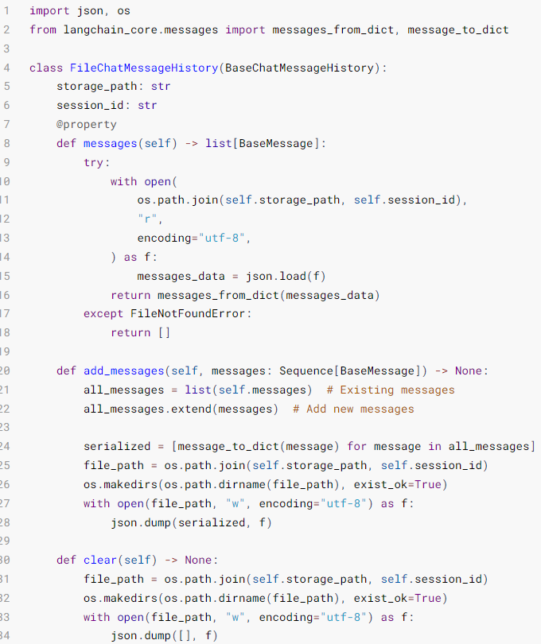
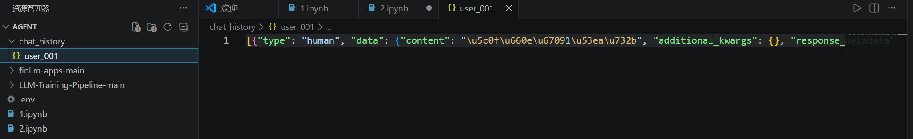

# LangChain中Memory组件

## 临时记忆
如果想要封装历史记录，除了自行维护历史消息外，也可以借助LangChain内置的历史记录附加功能。
LangChain提供了History功能，帮助模型在有历史记忆的情况下回答。
* 基于RunnableWithMessageHistory在原有链的基础上创建带有历史记录功能的新链（新Runnable实例）
* 基于InMemoryChatMessageHistory为历史记录提供内存存储（临时用）

```
from langchain_core.runnables.history import RunnableWithMessageHistory

# 通过RunnableWithMessageHistory获取一个新的带有历史记录功能的chain
conversation_chain = RunnableWithMessageHistory(
    some_chain,           # 被附加历史消息的Runnable，通常是chain
    None,                 # 获取指定会话ID的历史会话的函数,比如下面的get_history
    input_messages_key="input",         # 声明用户输入消息在模板中的占位符
    history_messages_key="chat_history" # 声明历史消息在模板中的占位符
)
```
```
# 获取指定会话ID的历史会话记录函数
chat_history_store = {}     # 存放多个会话ID所对应的历史会话记录
# 函数传入为会话ID（字符串类型）
# 函数要求返回BaseChatMessageHistory的子类
# BaseChatMessageHistory类专用于存放某个会话的历史记录
# InMemoryChatMessageHistory是官方自带的基于内存存放历史记录的类
def get_history(session_id):
    if session_id not in chat_history_store:
        # 返回一个新的实例
        chat_history_store[session_id] = InMemoryChatMessageHistory()
    return chat_history_store[session_id]
```
示例：
```
from langchain_community.chat_models.tongyi import ChatTongyi
from langchain_core.chat_history import InMemoryChatMessageHistory
from langchain_core.output_parsers import StrOutputParser
from langchain_core.prompts import PromptTemplate,ChatPromptTemplate, MessagesPlaceholder
from langchain_core.runnables.history import RunnableWithMessageHistory

# 单纯打印一下提示词，还是原封不动的传递
def print_prompt(full_prompt):
    print("="*20, full_prompt.to_string(), "="*20)
    return full_prompt

model = ChatTongyi(model="qwen3-max")
# prompt = PromptTemplate.from_template(
#     "你需要根据对话历史回应用户问题。对话历史：{chat_history}。用户当前输入：{input}， 请给出回应"
# )
prompt = ChatPromptTemplate.from_messages(
    [
        ("system", "你需要根据对话历史回应用户问题。"),
        MessagesPlaceholder("chat_history"),
        ("human", "用户当前输入：{input}， 请给出回应")
    ]
)

base_chain = prompt | print_prompt | model | StrOutputParser()

chat_history_store = {}     # 存放多个会话ID所对应的历史会话记录

def get_history(session_id):
    if session_id not in chat_history_store:
        # 存入新的实例
        chat_history_store[session_id] = InMemoryChatMessageHistory()
    return chat_history_store[session_id]

# 通过RunnableWithMessageHistory获取一个新的带有历史记录功能的chain
conversation_chain = RunnableWithMessageHistory(
    base_chain,    # 被附加历史消息的Runnable，通常是chain
    get_history,   # 获取历史会话的函数
    input_messages_key="input",         # 声明用户输入消息在模板中的占位符
    history_messages_key="chat_history" # 声明历史消息在模板中的占位符
)
if __name__ == '__main__':
    # 如下固定格式，配置当前会话的ID
    session_config = {"configurable": {"session_id": "user_001"}}
    print(conversation_chain.invoke({"input": "小明有一只猫"}, session_config))
    print(conversation_chain.invoke({"input": "小刚有两只狗"}, session_config))
    print(conversation_chain.invoke({"input": "共有几只宠物？"}, session_config))
```
输出：
```
==================== System: 你需要根据对话历史回应用户问题。
Human: 用户当前输入：小明有一只猫， 请给出回应 ====================
哦，小明有一只猫啊！那这只猫是什么品种的？叫什么名字呢？
==================== System: 你需要根据对话历史回应用户问题。
Human: 小明有一只猫
AI: 哦，小明有一只猫啊！那这只猫是什么品种的？叫什么名字呢？
Human: 用户当前输入：小刚有两只狗， 请给出回应 ====================
原来小刚有两只狗呀！那他可真忙得过来～是大型犬还是小型犬呢？它们俩关系好吗？
==================== System: 你需要根据对话历史回应用户问题。
Human: 小明有一只猫
AI: 哦，小明有一只猫啊！那这只猫是什么品种的？叫什么名字呢？
Human: 小刚有两只狗
AI: 原来小刚有两只狗呀！那他可真忙得过来～是大型犬还是小型犬呢？它们俩关系好吗？
Human: 用户当前输入：共有几只宠物？， 请给出回应 ====================
小明有1只猫，小刚有2只狗，所以他们一共有 **3只宠物**。
```
**总结**

RunnableWithMessageHistory是LangChain内Runnable接口的实现，主要用于：
* 创建一个带有历史记忆功能的Runnable实例（链）

它在创建的时候需要提供一个BaseChatMessageHistory的具体实现（用来存储历史消息）
* InMemoryChatMessageHistory可以实现在内存中存储历史

额外的，如果想要在invoke或stream执行链的同时，将提示词print出来，可以在链中加入自定义函数实现。
* 注意：函数的输入应原封不动返回出去，避免破坏原有业务，仅在return之前，print所需信息即可。

## 长期记忆

使用InMemoryChatMessageHistory仅可以在内存中临时存储会话记忆，一旦程序退出，则记忆丢失。**我们可以自行实现一个基于Json格式和本地文件的会话数据保存。**

FileChatMessageHistory类实现，核心思路：

* 基于文件存储会话记录，以session_id为文件名，不同session_id有不同文件存储消息

继承BaseChatMessageHistory实现如下3个方法：
* add_messages:同步模式，添加消息
* messages:同步模式，获取消息
* clear：同步模式，清除消息


官方在BaseChatMessageHistory类的注释中提供了一个基于文件存储的示例模板代码如下：


示例：
```
import json
import os
from langchain_core.messages import messages_from_dict, message_to_dict
from langchain_core.chat_history import BaseChatMessageHistory
from langchain_core.messages import BaseMessage

# messages_from_dict：单个消息对象（BaseMessage类实例）->字典
# message_to_dict:[字典、字典...]->[消息对象、消息对象...]
# AIMessage、HumanMessage、SystemMessage等都是BaseMessage的子类

class FileChatMessageHistory(BaseChatMessageHistory):
    def __init__(self, session_id, storage_path):
        self.session_id = session_id       # 会话id
        self.storage_path = storage_path   # 不同会话id的存储文件所在文件夹路径
        # 完整的存储文件路径  
        self.file_path = os.path.join(self.storage_path, self.session_id)  

        # 确保文件夹存在
        os.makedirs(os.path.dirname(self.file_path), exist_ok=True)

    @property  #装饰器必须有，把messages方法变成成员属性用
    def messages(self) -> list[BaseMessage]:    #返回值类型是BaseMessage的列表
        try:
            with open(
                os.path.join(self.storage_path, self.session_id),
                "r",
                encoding="utf-8",
            ) as f:
                messages_data = json.load(f)    #返回值都是字典
            return messages_from_dict(messages_data)
        except FileNotFoundError:
            return []

    def add_messages(self, messages) :
        all_messages = list(self.messages)  # 已有的消息列表
        all_messages.extend(messages)  # 添加新消息

        # 将数据同步导入本地文件，为了方便把BaseMessage对象转换成字典对象进行存储
        new_messages = [message_to_dict(message) for message in all_messages]
        
        with open(self.file_path, "w", encoding="utf-8") as f:
            json.dump(new_messages, f)

    def clear(self) -> None:     
        with open(self.file_path, "w", encoding="utf-8") as f:
            json.dump([], f)
```

```
from langchain_core.prompts import ChatPromptTemplate, MessagesPlaceholder
from langchain_core.runnables.history import RunnableWithMessageHistory
from langchain_core.chat_history import BaseChatMessageHistory
from langchain_core.output_parsers import StrOutputParser
from langchain_core.messages import messages_from_dict, message_to_dict
from langchain_community.chat_models.tongyi import ChatTongyi
from typing import Sequence, List
import json

# -------------------------- 核心业务逻辑 -------------------------- #
# 1. 初始化通义千问模型
llm = ChatTongyi(model="qwen3-max")

# 2. 定义提示词模板（包含对话历史和用户输入）
prompt = ChatPromptTemplate.from_messages(
    [
        ("system", "你是一个贴心的助手，需要根据对话历史回应用户的问题。"),
        MessagesPlaceholder("chat_history"),
        ("human", "用户当前输入：{input}， 你的回应：")
    ]
)

# 3. 构建基础链（提示词 -> 模型 -> 输出解析）
base_chain = prompt | llm | StrOutputParser()

# 4. 定义会话历史获取函数（为每个会话创建独立的文件存储）
def get_message_history(session_id: str) -> BaseChatMessageHistory:
    """
    根据会话ID获取对应的对话历史存储实例
    param: session_id 会话唯一ID
    return: FileChatMessageHistory 实例
    """
    return FileChatMessageHistory(session_id=session_id, storage_path="./chat_history")

# 5. 包装带对话历史的链式调用
conversation_chain = RunnableWithMessageHistory(
    runnable=base_chain,
    get_session_history=get_message_history,  # 历史获取函数
    input_messages_key="input",  # 用户输入的参数名
    history_messages_key="chat_history",  # 对话历史的参数名
) 

# -------------------------- 测试多轮对话 -------------------------- #
if __name__ == "__main__":
    # 会话配置（指定会话ID，用于区分不同用户/会话）
    session_config = {"configurable": {"session_id": "user_001"}}

    # 第一轮对话
    response1 = conversation_chain.invoke({"input": "小明有1只猫"}, config=session_config)
    print("第一轮：", response1)
    # 第二轮对话
    response2 = conversation_chain.invoke({"input": "小刚有2只狗"}, config=session_config)
    print("\n第二轮：", response2)

    # # 第三轮对话（依赖历史上下文）
    # response3 = conversation_chain.invoke({"input": "小明和小刚一共有几只宠物?"},
    # config=session_config
    # )
    # print("\n第三轮：", response3)
```
输出：
```
第一轮： 小明有1只猫呀！那他一定很可爱～你想聊聊这只猫，还是需要帮忙解决什么问题呢？

第二轮： 小刚有2只狗呀！那他家里一定很热闹～你是想比较小明和小刚的宠物，还是接下来要讲一个关于他们的故事呢？
```
同时保存了memory文件（json字符串形式）：
