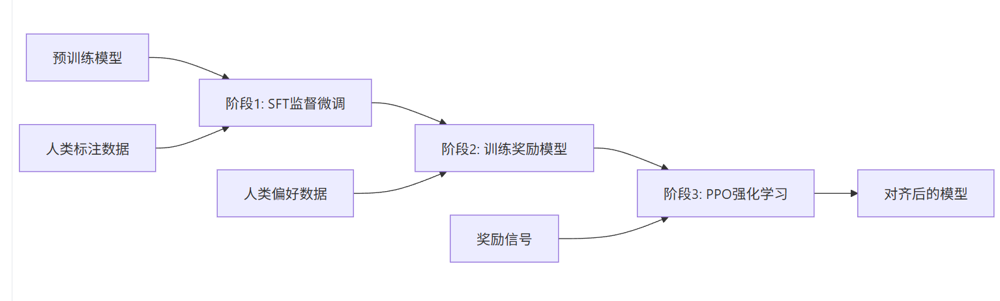
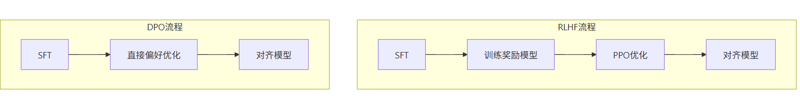

# SFT、RLHF、DPO怎么选？
## SFT
SFT(Supervised Fine-Tuning)，监督微调的本质是**基于预训练模型，用人工标注的“输入-输出”对进行有监督训练。**其目标是提升特定任务（如问答、摘要） 的准确性。本质是**延续语言建模目标**，让模型在封闭任务上快速收敛。

通俗讲，比如用户问题是糖尿病怎么控制饮食，我们给他一个标准回答，模型就学着模仿这个回答，他的目标很简单，就是让模型在特定任务上更准更快的给出正确答案，使回答越接近标注越好。但他只能根据模板回答，不能真正了解人类偏好，比如一个病人问他能不能吃一点糖，他可能通过医学文献回答可以少量摄入，但忽略了用户是糖尿病患者。甚至有可能给他推荐错误用药。所以SFT只能解决对不对的问题，不能解决好不好，安全不安全的问题。

✅ 优点：   
* 实现简单，工程门槛低     
* 计算成本低，训练速度快   
* 稳定性高，几乎不会出现训练崩溃  

❌ 缺点：    
* 只能模仿标注答案，无法理解人类深层偏好   
* 缺乏灵活性，难以应对标注外的情况    
* 无法解决 "安全对齐" 问题（如拒绝有害请求）  

## RLHF
人类反馈驱动强化，RLHF（Reinforcement Learning from Human Feedback，基于人类反馈的强化学习）是一种结合强化学习和人类反馈的模型训练方法。它的核心思想是：**通过人类对模型输出的偏好判断，训练一个奖励模型来评估输出质量，然后用强化学习优化语言模型，使其生成能获得高奖励的内容。**

通俗讲,好比一个教练带运动员，光看教材和动作还不够，得有人告诉他你这次跳的还不错，下次起跳再快一点。

RLHF是一个三步走的过程：

第一步：监督微调（SFT）。

* 监督微调是RLHF的第一步，目的是让预训练模型学会按照指令格式生成回答。 这相当于给AI一些示范，告诉它"这样回答是好的"。工程师们会收集高质量的问答对，让模型通过模仿学习基本的回答方式。

第二步：奖励模型训练（RM）。

* 奖励模型（Reward Model）是RLHF的核心组件，它学习人类的偏好来评估模型输出的质量。这一步要训练一个能"评分"的模型。人类标注者会对同一问题的不同回答进行比较和排序，然后用这些数据训练一个能预测"人类会更喜欢哪个回答"的模型。

第三步：强化学习（RL）。

* 最后，利用第二步训练的奖励模型作为指导，对语言模型进行优化。每当模型生成一个回答，奖励模型就会给出评分，模型根据这个信号不断调整自己的策略，逐渐生成更符合人类偏好的内容。**PPO（Proximal Policy Optimization）是RLHF中最常用的强化学习算法，用于优化语言模型以获得更高的奖励。**

✅ 优点：    
* 输出质量高，全面符合人类价值观和期望   
* 能处理复杂的人类偏好，包括隐式价值观   
* 广泛应用于 ChatGPT 等顶级对话模型      

❌ 缺点：  
* 流程复杂，工程实现难度大   
* 计算成本极高，需大量 GPU 资源   
* 训练不稳定，易出现奖励黑客、模式崩溃等问题   
* 奖励模型偏差可能传递给最终模型  

## DPO
DPO（Direct Preference Optimization）是RLHF的一种简化替代方案，它直接从偏好数据优化策略，无需训练单独的奖励模型。其核心思想就是**将偏好问题转换为了一个分类问题**，通过损失函数直接让“优胜”回答的概率高于“失败”回答，从而绕过奖励模型和复杂的强化学习算法。

✅ 优点：
* 流程简化，无需 RM 和 PPO，工程门槛低
* 计算效率高，训练速度提升 3-5 倍，显存占用下降 40%
* 训练稳定，无 RM 偏差传递，无 PPO 不稳定性
* 对齐效果接近 RLHF，部分任务可达 90%+ 性能

❌ 缺点：
* 高度依赖高质量 SFT 模型，SFT 质量直接影响最终效果
* 在某些复杂推理任务上略逊于 RLHF（约 5-10%）
* 对极端偏好对的处理能力可能弱于 RLHF

## 总结

适用场景对比：
1. 适合使用 SFT 的场景     
快速适配特定任务（如文本分类、摘要生成）   
资源有限，无法承担复杂训练流程   
任务有明确标准答案，不需要深层偏好对齐   
模型原型开发，快速验证想法   

2. 适合使用 RLHF 的场景   
顶级对话模型开发（如 ChatGPT、Claude）   
对输出质量和人类对齐要求极高的场景   
有充足计算资源和专业团队支持   
需要处理复杂人类价值观和伦理问题的模型   

3. 适合使用 DPO 的场景   
希望获得接近 RLHF 效果但资源有限   
快速迭代对齐模型，缩短开发周期   
中小规模团队开发对话模型
需要避免 RLHF 复杂流程和稳定性问题   
研究 RLHF 替代方案，探索更高效对齐方法   

实际应用建议：

1. 新手入门：优先选择 SFT，掌握基础对齐技术   
2. 资源有限但追求高质量：采用 SFT+DPO 组合，平衡效果与效率   
3. 资源充足且追求顶级效果：采用完整 RLHF 流程，或 RLHF+DPO 混合优化

关键注意点：无论选择哪种方法，高质量数据都是成功的基础，特别是 SFT 阶段的数据质量直接影响后续所有对齐效果

参考文献：      
[RLHF](https://qubittool.com/zh/blog/rlhf-reinforcement-learning-human-feedback-guide)
[从PPO、DPO到GRPO](https://www.cnblogs.com/gongzb/p/18999006)