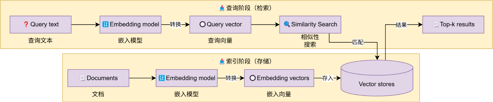

# Vector stores向量存储

## 简述
基于LangChain的向量存储，存储嵌入数据，并执行相似性搜索。   

如图，这是一个典型的向量存储应用，也即是典型的RAG流程。



这部分开发主要涉及到：

* 如何文本转向量（前文已经学习）
* 创建向量存储，基于向量存储完成：

    * 存入向量  ===  add_documents   
    * 删除向量  ===  delete   
    * 向量检索  ===  similarity_search

## 内置向量存储的使用:
```
from langchain_core.vectorstores import InMemoryVectorStore
from langchain_community.embeddings import DashScopeEmbeddings

vector_store = InMemoryVectorStore(embedding=DashScopeEmbeddings())

# 添加文档到向量存储，并指定id
vector_store.add_documents(documents=[doc1, doc2], ids=["id1", "id2"])

# 删除文档（通过指定的id删除）
vector_store.delete(ids=["id1"])

# 相似性搜索
similar_docs = vector_store.similarity_search("your query here", 4)
```
实例：
```
from langchain_core.vectorstores import InMemoryVectorStore
from langchain_community.embeddings import DashScopeEmbeddings
from langchain_community.document_loaders import CSVLoader

vector_store = InMemoryVectorStore(
    embedding=DashScopeEmbeddings()
)


loader = CSVLoader(
    file_path="./info.csv",
    encoding="utf-8",
    source_column="source",     # 指定本条数据的来源是哪里
)

documents = loader.load()
# id1 id2 id3 id4 ...
# 向量存储的 新增、删除、检索
vector_store.add_documents(
    documents=documents,        # 被添加的文档，类型：list[Document]
    ids=["id"+str(i) for i in range(1, len(documents)+1)] # 给添加的文档提供id（字符串）  list[str]
)

# 删除  传入[id, id...]
vector_store.delete(["id1", "id2"])

# 检索 返回类型list[Document]
result = vector_store.similarity_search(
    query:"python是不是简单易学",
    k:3       # 检索的结果要几个
)

print(result)
```

## 外部（Chroma）向量存储的使用:
```
from langchain_community.embeddings import DashScopeEmbeddings
from langchain_chroma import Chroma

vector_store = Chroma(
    collection_name="example_collection",
    embedding_function=DashScopeEmbeddings(),
    persist_directory="./chroma_langchain_db",  # 
)
```
实例：
```
from langchain_chroma import Chroma
from langchain_community.embeddings import DashScopeEmbeddings
from langchain_community.document_loaders import CSVLoader

# Chroma 向量数据库（轻量级的）
# 确保 langchain-chroma chromadb 这两个库安装了的，没有的话请pip install

vector_store = Chroma(
    collection_name="test",     # 当前向量存储起个名字，类似数据库的表名称
    embedding_function=DashScopeEmbeddings(),       # 嵌入模型
    persist_directory="./chroma_db"     # 指定数据存放的文件夹
)


# loader = CSVLoader(
#     file_path="./data/info.csv",
#     encoding="utf-8",
#     source_column="source",     # 指定本条数据的来源是哪里
# )
#
# documents = loader.load()
# # id1 id2 id3 id4 ...
# # 向量存储的 新增、删除、检索
# vector_store.add_documents(
#     documents=documents,        # 被添加的文档，类型：list[Document]
#     ids=["id"+str(i) for i in range(1, len(documents)+1)] # 给添加的文档提供id（字符串）  list[str]
# )
#
# # 删除  传入[id, id...]
# vector_store.delete(["id1", "id2"])

# 检索 返回类型list[Document]
result = vector_store.similarity_search(
    "Python是不是简单易学呀",
    3,        # 检索的结果要几个
    filter={"source": "黑马程序员"}
)

print(result)
```
##  检索向量并构建提示词
```
"""
提示词：用户的提问 + 向量库中检索到的参考资料
"""
from langchain_community.chat_models import ChatTongyi
from langchain_core.vectorstores import InMemoryVectorStore
from langchain_community.embeddings import DashScopeEmbeddings
from langchain_core.prompts import ChatPromptTemplate
from langchain_core.output_parsers import StrOutputParser


def print_prompt(prompt):
    print(prompt.to_string())
    print("=" * 20)
    return prompt


model = ChatTongyi(model="qwen3-max")
prompt = ChatPromptTemplate.from_messages(
    [
        ("system", "以我提供的已知参考资料为主，简洁和专业的回答用户问题。参考资料:{context}。"),
        ("user", "用户提问：{input}")
    ]
)

vector_store = InMemoryVectorStore(embedding=DashScopeEmbeddings(model="text-embedding-v4"))

# 准备一下资料（向量库的数据）
# add_texts 传入一个 list[str]
vector_store.add_texts(
    ["减肥就是要少吃多练", "在减脂期间吃东西很重要,清淡少油控制卡路里摄入并运动起来", "跑步是很好的运动哦"])

input_text = "怎么减肥？"

# 检索向量库
result = vector_store.similarity_search(input_text, 2)
reference_text = "["
for doc in result:
    reference_text += doc.page_content
reference_text += "]"

chain = prompt | print_prompt | model | StrOutputParser()

res = chain.invoke({"input": input_text, "context": reference_text})
print(res)
```
向量存储的实例，通过add_texts(list[str])方法可以快速添加到向量存储中。

流程：
* 先通过向量存储检索匹配信息
* 将用户提问和匹配信息一同封装到提示词模板中提问模型

## RunnablePassthrough
让向量检索也加入到链中。
```
"""
提示词：用户的提问 + 向量库中检索到的参考资料
"""
from langchain_community.chat_models import ChatTongyi
from langchain_core.documents import Document
from langchain_core.runnables import RunnablePassthrough
from langchain_core.vectorstores import InMemoryVectorStore
from langchain_community.embeddings import DashScopeEmbeddings
from langchain_core.prompts import ChatPromptTemplate
from langchain_core.output_parsers import StrOutputParser


def print_prompt(prompt):
    print(prompt.to_string())
    print("=" * 20)
    return prompt


model = ChatTongyi(model="qwen3-max")
prompt = ChatPromptTemplate.from_messages(
    [
        ("system", "以我提供的已知参考资料为主，简洁和专业的回答用户问题。参考资料:{context}。"),
        ("user", "用户提问：{input}")
    ]
)

vector_store = InMemoryVectorStore(embedding=DashScopeEmbeddings(model="text-embedding-v4"))

# 准备一下资料（向量库的数据）
# add_texts 传入一个 list[str]
vector_store.add_texts(
    ["减肥就是要少吃多练", "在减脂期间吃东西很重要,清淡少油控制卡路里摄入并运动起来", "跑步是很好的运动哦"])

input_text = "怎么减肥？"

# langchain中向量存储对象，有一个方法：as_retriever，可以返回一个Runnable接口的子类实例对象
retriever = vector_store.as_retriever(search_kwargs={"k": 2})


def format_func(docs: list[Document]):
    if not docs:
        return "无相关参考资料"

    formatted_str = "["
    for doc in docs:
        formatted_str += doc.page_content
    formatted_str += "]"

    return formatted_str

# chain
chain = (
    {"input": RunnablePassthrough(), "context": retriever | format_func} | prompt | print_prompt | model | StrOutputParser()
)

res = chain.invoke(input_text)
print(res)
"""
retriever:
    - 输入：用户的提问       str
    - 输出：向量库的检索结果  list[Document]
prompt:
    - 输入：用户的提问 + 向量库的检索结果   dict
    - 输出：完整的提示词                 PromptValue
"""
```