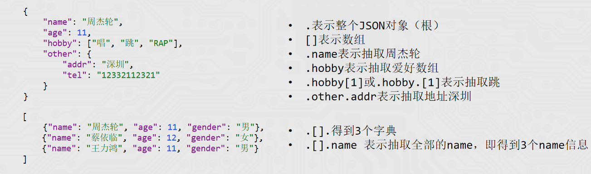

# Document loaders （文档加载器）

## 简介
文档加载器提供了一套标准接口，用于将不同来源（如 CSV、PDF 或 JSON等）的数据读取为 LangChain 的文档格式。这确保了无论数据来源如何，都能对其进行一致性处理。     
文档加载器（内置或自行实现）需实现BaseLoader接口。

Class Document，是LangChain内文档的统一载体，所有文档加载器最终返回此类的实例。
一个基础的Document类实例，基于如下代码创建：
```
from langchain_core.documents import Document

document = Document(
    page_content="Hello, world!", metadata={"source": "https://example.com"}
)
```
可以看到，Document类其核心记录了：    
* page_content：文档内容   
* metadata：文档元数据（字典）

不同的文档加载器可能定义了不同的参数，但是其都实现了统一的接口（方法）：
* load()：一次性加载全部文档
* lazy_load()：延迟流式传输文档，对大型数据集很有用，避免内存溢出。

```
from langchain_community.document_loaders.csv_loader import CSVLoader

loader = CSVLoader(
    ...  # 初始化参数
)
# 一次性加载全部文档
documents = loader.load()

# 对于大数据集，分段返回文档
for document in loader.lazy_load():
    print(document)
```
## CSVLoader
```
from langchain_community.document_loaders.csv_loader 
import CSVLoader

loader = CSVLoader(
    file_path="./xxx.csv",
    encoding="utf-8"     # 指定编码避免报错
    csv_args={
        “delimiter”: ",",   # 指定分隔符
        “quotechar”: '"'     # 指定字符串的引号包裹，引号中内容不分隔
        # 字段列表（无表头使用，有表头勿用，会读取首行做为数据）
        "fieldnames": ["name", "age", "gender"],
    },
)

data = loader.load()
print(data)
```
## JSONLoader
JSONLoader用于将JSON数据加载为Document类型对象。  
使用JSONLoader需要额外安装： pip install jq

jq是一个跨平台的json解析工具，LangChain底层对JSON的解析就是基于jq工具实现的。  
将JSON数据的信息抽取出来，封装为Document对象，抽取的时候依赖jq_schema语法。



实例：

如下是一个典型的JsonLines文件（每一行都是JSON的文件）
```
{"name": "周杰轮", "age": 11, "gender": "男"},
{"name": "蔡依临", "age": 12, "gender": "女"},
{"name": "王力鸿", "age": 11, "gender": "男"}
```
```
from langchain_community.document_loaders import JSONLoader

loader = JSONLoader(
    file_path="xxx.json",   # 文件路径
    jq_schema=".",          # jq schema语法
    text_content=False,     # 抽取的是否是字符串，默认True
    json_lines=True,        # 是否是JsonLines文件（每一行都是JSON的文件）
)

document = loader.load()
print(document)
```
## PyPDFLoader
LangChain内支持许多PDF的加载器，我们选择其中的PyPDFLoader使用。   
PyPDFLoader加载器，依赖PyPDF库，所以，需要安装它：   
>pip install pypdf

PyPDFLoader使用还是比较简单的，如下代码即可快速加载PDF中的文字内容了：
```
from langchain_community.document_loaders import PyPDFLoader

loader = PyPDFLoader(
    file_path="",   # 文件路径必填
    mode='page',    # 读取模式，可选page（按页面划分不同Document）和single（单个Document）
    password='password', # 文件密码,如果pdf加密了
)
```

## TextLoader

除了前文学习的三个Loader以外，还有一个基本的加载器：TextLoader     
作用：读取文本文件（如.txt），将全部内容放入一个Document对象中。
```
from langchain_community.document_loaders import TextLoader
loader = TextLoader(
    "xxx.txt",
    encoding="utf-8",
    )
docs = loader.load()
print(docs)
print(len(docs))	# 结果为1
```

如果文档很大,加载到一个Document对象中是否不太合适,这时候就需要文本分割器。

## RecursiveCharacterTextSplitter

RecursiveCharacterTextSplitter，递归字符文本分割器，主要用于按自然段落分割大文档。   
是LangChain官方推荐的默认字符分割器。    
它在保持上下文完整性和控制片段大小之间实现了良好平衡，开箱即用效果佳。   

```
from langchain_community.document_loaders import TextLoader
from langchain_text_splitters import RecursiveCharacterTextSplitter

loader = TextLoader(
        "../P3_LangChainRAG开发/data/Python基础语法.txt",
        encoding="utf-8",
)
docs = loader.load()

splitter = RecursiveCharacterTextSplitter(
    chunk_size=500,     # 分段的最大字符数
    chunk_overlap=50,   # 分段之间允许重叠的字符数
    # 文本分段依据
    separators=["\n\n", "\n", "。", "！", "？", ".", "!", "?", " ", ""],
    # 字符统计依据（函数）
    length_function=len,
)

split_docs = splitter.split_documents(docs)
```
TextLoader是一个简单的加载器，可以加载文本文件内容，返回仅有一个Document对象的list。

RecursiveCharacterTextSplitter递归字符文本分割器，是LangChain官方推荐的默认分割器。
* 基于文本的自然段落分割大文档为小文档
* 可以指定小文档的最大字符数、重叠字符数
* 可以手动指定段落划分的依据（符号）以及字符数量统计函数


## 参考文献
[langchain官方文档](https://docs.langchain.com/oss/python/integrations/document_loaders)