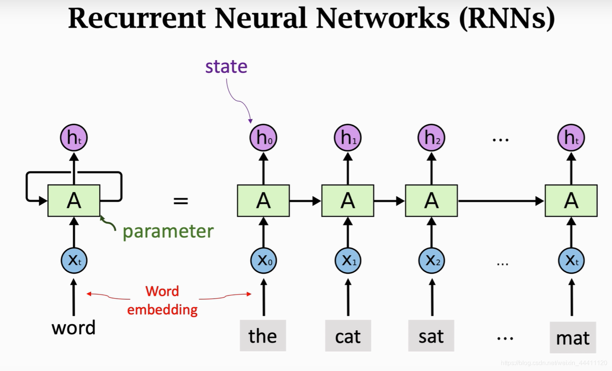
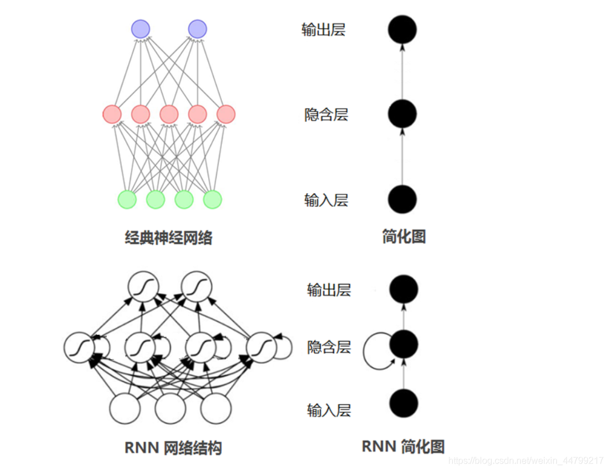
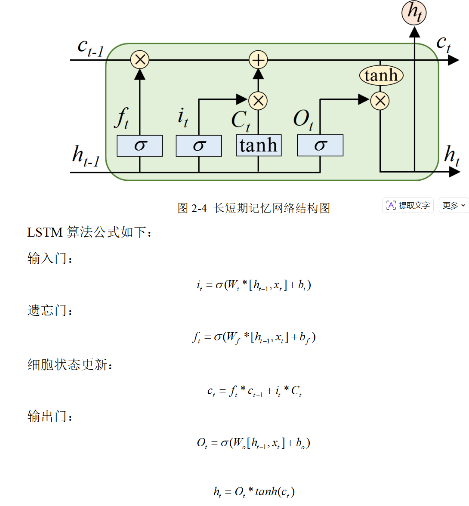
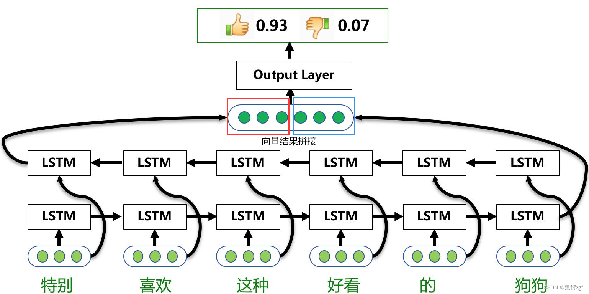
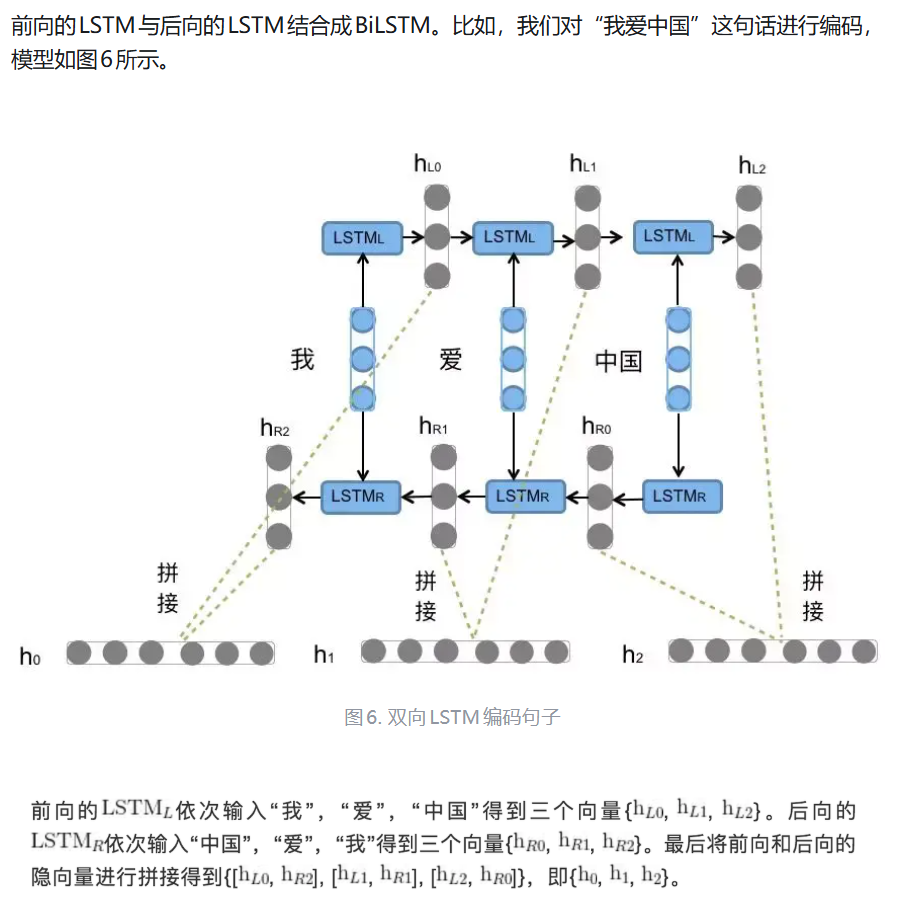
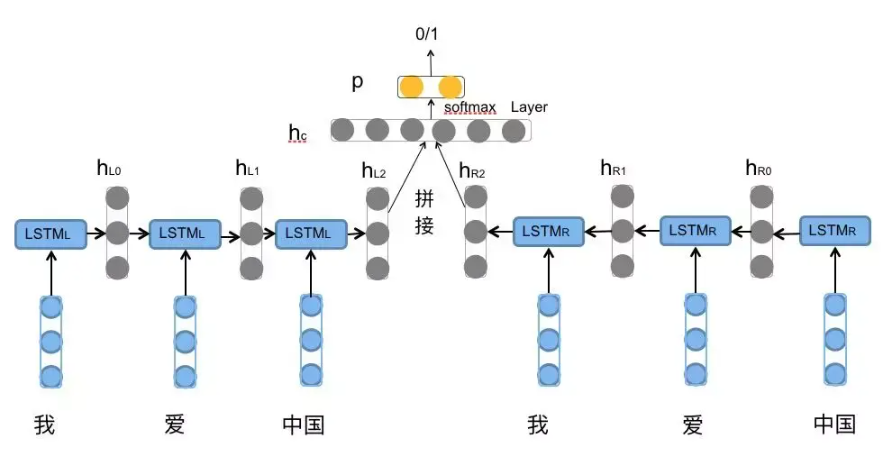

# BiLSTM 双向长短期记忆网络

## RNN
### 简介
循环神经网络（Recurrent Neural Network, RNN）是一类具有内部环状连接的人工神经网络，用于处理序列数据。其最大特点是网络中存在着环，使得信息能在网络中进行循环，实现对序列信息的存储和处理。

### 工作原理


输入层：RNN能够接受一个输入序列（例如文字、股票价格、语音信号等）并将其传递到隐藏层。

隐藏层：隐藏层之间存在循环连接，使得网络能够维护一个“记忆”状态，这一状态包含了过去的信息。这使得RNN能够理解序列中的上下文信息。

输出层：RNN可以有一个或多个输出，例如在序列生成任务中，每个时间步都会有一个输出。

### 简单的RNN代码示例：
```
class SimpleRNN(nn.Module):
    def __init__(self, input_size, hidden_size):
        super(SimpleRNN, self).__init__()
        self.rnn = nn.RNN(input_size, hidden_size, batch_first=True)

    def forward(self, x):
        out, _ = self.rnn(x)
        return out
```
### RNN的优缺点

优点：
* 能够处理不同长度的序列数据。
* 能够捕捉序列中的时间依赖关系。

缺点：

* 对长序列的记忆能力较弱，可能出现梯度消失或梯度爆炸问题。
* 训练可能相对复杂和时间消耗大。

**总结**   
循环神经网络是一种强大的模型，特别适合于处理具有时间依赖性的序列数据。然而，标准RNN通常难以学习长序列中的依赖关系，因此有了更多复杂的变体如LSTM和GRU，来解决这些问题。不过，RNN的基本理念和结构仍然是深度学习中序列处理的核心组成部分。

## LSTM
### 简介
在深度学习领域，循环神经网络（RNN）在处理序列数据方面具有独特的优势，例如语音识别、自然语言处理等任务。然而，传统的 RNN 在处理长序列数据时面临着严重的梯度消失问题，这使得网络难以学习到长距离的依赖关系。LSTM 作为一种特殊的 RNN 架构应运而生，有效地解决了这一难题，成为了序列建模领域的重要工具。

### 工作原理

**1、细胞状态**

LSTM 的核心是细胞状态（Cell State），它类似于一条信息传送带，贯穿整个时间序列。细胞状态能够在序列的各个时间步中保持相对稳定的信息传递，从而使得网络能够记忆长距离的信息。在每个时间步，细胞状态会根据输入门、遗忘门和输出门的控制进行信息的更新与传递。

LSTM的核心是其复杂的记忆单元结构，包括以下组件：

* 遗忘门：控制哪些信息从单元状态中被丢弃。

* 输入门：控制新信息的哪些部分要存储在单元状态中。

* 单元状态：储存过去的信息，通过遗忘门和输入门的调节进行更新。

* 输出门：控制单元状态的哪些部分要读取和输出。

与反向传播算法基本相同，LSTM的参数训练算法主要有三个步骤:

* 一是前向计算每个神经元的输出值。对于LSTM而言，根据上述计算公式，分别进行计算。
* 二是确定优化目标函数。刚开始训练时，输出值和预期值会有差异，因此构造出损失函数，计算每个神经元的误差项值。
* 三是利用损耗函数求出梯度值，对神经网络的超参量进行逆向修正。与传统循环神经网络相似，短时记忆误差项的逆向传递分为两个层次：一是在空间层次，即把错误项传递到上层网络。二是在时间维度上进行逆向传输，也就是从现在的时间点t出发，对各个时间点的误差进行分析。
* 然后跳转第一步，重复做第一、二和三步，直至网络误差小于给定值。

### 简单LSTM代码示例
```
# LSTM的PyTorch实现
import torch.nn as nn

class LSTM(nn.Module):
    def __init__(self, input_size, hidden_size, output_size):
        super(LSTM, self).__init__()
        self.lstm = nn.LSTM(input_size, hidden_size, batch_first=True)
        self.fc = nn.Linear(hidden_size, output_size)

    def forward(self, x, (h_0, c_0)):
        out, (h_n, c_n) = self.lstm(x, (h_0, c_0)) # 运用LSTM层
        out = self.fc(out) # 运用全连接层
        return out
```

### LSTM优缺点
**优点：**
* **长距离依赖学习能力**  
如前文所述，LSTM 能够有效地解决传统 RNN 中的梯度消失问题，从而可以学习到序列数据中长距离的依赖关系。这使得它在处理诸如长文本、长时间序列等数据时表现出色，能够捕捉到数据中深层次的语义、趋势和模式。
* **灵活性与适应性**  
LSTM 可以应用于多种不同类型的序列数据处理任务，无论是自然语言、时间序列还是语音信号等。它的门控机制使得模型能够根据不同的数据特点和任务需求，灵活地调整细胞状态中的信息保留与更新，具有较强的适应性。

**缺点:**

* **计算复杂度较高**  
由于 LSTM 的细胞结构和门控机制相对复杂，相比于简单的神经网络模型，其计算复杂度较高。在处理大规模数据或构建深度 LSTM 网络时，训练时间和计算资源的需求可能会成为瓶颈，需要强大的计算硬件支持。
* **可能存在过拟合**   
在数据量较小或模型参数过多的情况下，LSTM 模型也可能出现过拟合现象，即模型过于适应训练数据，而对新的数据泛化能力较差。需要采用一些正则化技术，如 L1/L2 正则化、Dropout 等，来缓解过拟合问题。

### 总结
长短时记忆网络（LSTM）是循环神经网络的重要扩展，具有捕获长序列依赖关系的能力。通过引入门控机制，LSTM可以精细控制信息的流动，既能记住长期的依赖信息，也能忘记无关的细节。这些特性使LSTM在许多序列处理任务中都得到了广泛的应用。

LSTM 的应用领域：  
（一）自然语言处理：语言模型、机器翻译、文本分类   
（二）时间序列预测：股票价格预测、气象预测  
（三）语音识别

## BiLSTM
### 简介
BiLSTM全称：Bi-directional Long Short-Term Memory，由前向LSTM与后向LSTM组合而成。

**为什么要有LSTM和BiLSTM：**  
将词的表示组合成句子的表示，可以采用相加的方法，即将所有词的表示进行加和，或者取平均等方法，但是这些方法没有考虑到词语在句子中前后顺序。如句子“我不觉得他好”。“不”字是对后面“好”的否定，即该句子的情感极性是贬义。**使用LSTM模型可以更好的捕捉到较长距离的依赖关系**。因为LSTM通过训练过程可以学到应该记忆哪些信息和遗忘哪些信息。

但是利用LSTM对句子进行建模还存在一个问题：**无法编码从后到前的信息**。在更细粒度的分类时，如对于强程度的褒义、弱程度的褒义、中性、弱程度的贬义、强程度的贬义的五分类任务需要注意情感词、程度词、否定词之间的交互。举一个例子，“这个餐厅脏得不行，没有隔壁好”，这里的“不行”是对“脏”的程度的一种修饰，**通过BiLSTM可以更好的捕捉双向的语义依赖。**
### 工作原理

如图所示：单层的BiLSTM是由两个LSTM组合而成，一个是正向去处理输入序列；另一个反向处理序列，处理完成后将两个LSTM的输出拼接起来。在上图中，只有所有的时间步计算完成后，才能得到最终的BiLSTM的输出结果。正向的LSTM经过6个时间步得到一个结果向量；反向的LSTM同样经过6个时间步后得到另一个结果，将这两个结果向量拼接起来，得到最终的BiLSTM输出结果。


对于情感分类任务来说，我们采用的句子的表示往往是[$h_{L2}$,$h_{R2}$]。因为其包含了前向与后向的所有信息，如下图所示。


### 简短代码示例
```
import torch
import torch.nn as nn
import torch.nn.functional as F
from torch.autograd import Variable

torch.manual_seed(123456)


class BLSTM(nn.Module):
    """
        Implementation of BLSTM Concatenation for sentiment classification task
    """

    def __init__(self, embeddings, input_dim, hidden_dim, num_layers, output_dim, max_len=40, dropout=0.5):
        super(BLSTM, self).__init__()

        self.emb = nn.Embedding(num_embeddings=embeddings.size(0),
                                embedding_dim=embeddings.size(1),
                                padding_idx=0)
        self.emb.weight = nn.Parameter(embeddings)

        self.input_dim = input_dim
        self.hidden_dim = hidden_dim
        self.output_dim = output_dim

        # sen encoder
        self.sen_len = max_len
        self.sen_rnn = nn.LSTM(input_size=input_dim,
                               hidden_size=hidden_dim,
                               num_layers=num_layers,
                               dropout=dropout,
                               batch_first=True,
                               bidirectional=True)

        self.output = nn.Linear(2 * self.hidden_dim, output_dim)

    def bi_fetch(self, rnn_outs, seq_lengths, batch_size, max_len):
        rnn_outs = rnn_outs.view(batch_size, max_len, 2, -1)

        # (batch_size, max_len, 1, -1)
        fw_out = torch.index_select(rnn_outs, 2, Variable(torch.LongTensor([0])).cuda())
        fw_out = fw_out.view(batch_size * max_len, -1)
        bw_out = torch.index_select(rnn_outs, 2, Variable(torch.LongTensor([1])).cuda())
        bw_out = bw_out.view(batch_size * max_len, -1)

        batch_range = Variable(torch.LongTensor(range(batch_size))).cuda() * max_len
        batch_zeros = Variable(torch.zeros(batch_size).long()).cuda()

        fw_index = batch_range + seq_lengths.view(batch_size) - 1
        fw_out = torch.index_select(fw_out, 0, fw_index)  # (batch_size, hid)

        bw_index = batch_range + batch_zeros
        bw_out = torch.index_select(bw_out, 0, bw_index)

        outs = torch.cat([fw_out, bw_out], dim=1)
        return outs

    def forward(self, sen_batch, sen_lengths, sen_mask_matrix):
        """
        :param sen_batch: (batch, sen_length), tensor for sentence sequence
        :param sen_lengths:
        :param sen_mask_matrix:
        :return:
        """

        ''' Embedding Layer | Padding | Sequence_length 40'''
        sen_batch = self.emb(sen_batch)

        batch_size = len(sen_batch)

        ''' Bi-LSTM Computation '''
        sen_outs, _ = self.sen_rnn(sen_batch.view(batch_size, -1, self.input_dim))
        sen_rnn = sen_outs.contiguous().view(batch_size, -1, 2 * self.hidden_dim)  # (batch, sen_len, 2*hid)

        ''' Fetch the truly last hidden layer of both sides
        '''
        sentence_batch = self.bi_fetch(sen_rnn, sen_lengths, batch_size, self.sen_len)  # (batch_size, 2*hid)

        representation = sentence_batch
        out = self.output(representation)
        out_prob = F.softmax(out.view(batch_size, -1))

        return out_prob
```
__init__()函数中对网络进行初始化，设定词向量维度，前向/后向LSTM中隐层向量的维度，还有要分类的类别数等。


bi_fetch()函数的作用是将 
 与 
 拼接起来并返回拼接后的向量。由于使用了batch，所以需要使用句子长度用来定位开始padding时前一个时刻的输出的隐层向量。


forward()函数里进行前向计算，得到各个类别的概率值。
### 总结
除了情感分类任务，LSTM与BiLSTM在自然语言处理领域的其它任务上也得到了广泛应用，如机器翻译任务中使用其进行源语言的编码和目标语言的解码，机器阅读理解任务中使用其对文章和问题的编码等。

BiLSTM的优势在于其能够同时考虑序列中的前向和后向信息，这使得它在处理具有复杂上下文关系的序列数据时表现出色。然而，BiLSTM也存在一些局限性，如计算成本较高，因为它需要同时训练两个LSTM网络。此外，BiLSTM在处理非常长的序列时可能会遇到梯度消失或爆炸的问题，尽管LSTM的门控机制已经在一定程度上缓解了这一问题。

总的来说，BiLSTM模型通过其独特的双向结构为序列分析任务提供了强大的工具，尤其是在需要理解序列中长距离依赖关系的场景中。随着深度学习技术的不断进步，BiLSTM及其变体将继续在各种序列处理任务中发挥重要作用。


## 参考
循环神经网络RNN完全解析：https://zhuanlan.zhihu.com/p/652712909

LSTM详解： https://blog.csdn.net/2301_80840905/article/details/144107247

双向长短期记忆网络（BiLSTM）详解：https://blog.csdn.net/qq_45556665/article/details/127685988