# Bert及其变种模型

## 一、BERT概述
BERT（Bidirectional Encoder Representations from Transformers）是 Google 于 2018 年提出的预训练语言模型，其核心是基于 Transformer 编码器的双向上下文理解能力。通过在大规模文本数据上进行无监督预训练，BERT 能够捕捉语言的深层语义关系，随后通过微调（Fine-tuning）适配各类自然语言处理（NLP）任务，如情感分析、问答系统、文本分类等。这一模型的出现彻底改变了 NLP 领域的研究范式，推动了多项任务达到人类水平的表现。

**1.1 核心创新：双向编码与预训练机制**

与传统单向语言模型（如 GPT）不同，BERT 通过掩码语言模型（MLM ）和下一句预测（NSP）两项预训练任务，实现了对文本的双向上下文建模。MLM 随机掩盖输入文本中的部分词汇，迫使模型根据上下文预测被掩盖的词，类似于 “完形填空”；NSP 则判断两个句子是否为连续文本，强化模型对语义连贯性的理解。这种双向编码能力使 BERT 能够更精准地捕捉词汇的语义关联，例如 “银行” 在 “存钱到银行” 和 “河流的银行” 中的不同含义，BERT 可通过上下文动态区分。

**1.2 模型结构与参数规模**

BERT 有两种主要版本：

* BERT-BASE：包含 12 层 Transformer 编码器，768 维隐藏层，12 个注意力头，参数量约 1.1 亿。编码器中的全连接网络包含 768 个隐藏单元。因此，从该模型中得到的向量大小也就是 768。 
* BERT-LARGE：24 层 Transformer 编码器，1024 维隐藏层，16 个注意力头，参数量约 3.4 亿。编码器中的全连接网络包含 1024 个隐藏单元。因此，从该模型中得到的向量大小也就是 1024。

其输入表示由 Token Embeddings（词向量）、Segment Embeddings（区分句子）和 Position Embeddings（位置编码）三部分相加构成。值得注意的是，BERT 的位置编码是通过学习得到的，而非 Transformer 中传统的固定三角函数编码，这使得模型能更好地适应序列位置的语义变化。

## 原理

从 BERT 的全称，Bidirectional Encoder Representation from Transformer（来自 Transformer 的双向编码器表征），可以看出 BERT 是基于 Transformer 模型的，但是只是其中的编码器。

我们输入一个句子，Transformer 的编码器会输出句子中每个单词的编码表示。那双向的代表什么意思？

由于 Transformer 编码器天然就是双向的，因为它的输入是完整的句子，也就是说指定某个单词，BERT 已经读入了它两个方向上的所有单词。

我们举一个例子来理解 BERT 是如何从 Transformer 中得到双向编码表示的。

假设我们有一个句子 A：He got bit by Python，现在我们把这个句子输入 Transformer 并得到了每个单词的上下文表示（嵌入表示）作为输出。

Transformer 的编码器通过多头注意力机制理解每个单词的上下文，然后输出每个单词的嵌入向量。

如下图所示，我们输入一个句子到 Transformer 的编码器，它输出句子中每个单词的上下文表示。

我们可以叠加 N 个编码器。下图中 $R_{He}$ 代表单词 He 的向量表示，每个单词向量表示的大小应当于每个编码器层的大小。
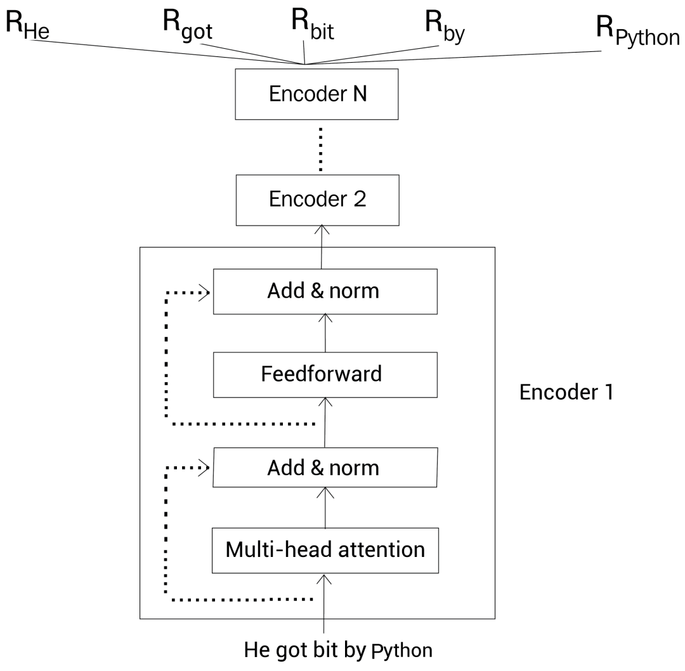

这样，通过 BERT，给定一个句子，我们就得到了句子中每个单词的上下文嵌入向量表示。

## 预训练BERT模型
预训练的意思是，假设我们有一个模型 m，首先我们为某种任务使用大规模的语料库训练模型 m。

现在来了一个新任务，并有一个新模型，我们使用已经训练过的模型（预训练的模型）m 的参数来初始化新的模型，而不是使用随机参数来初始化新模型。然后根据新任务调整（微调）新模型的参数。这是一种迁移学习。

BERT 模型在大规模语料库中通过两个任务来预训练，分别叫屏蔽语言建模（MLM）和下一句预测（NSP）。

我们会探讨如何进行预训练的，但在此之前，先看下如何表示输入数据。

## 输入数据表示
在把数据喂给 BERT之 前，我们通过下面三个嵌入层将输入转换为嵌入向量：

* 标记嵌入（Token embedding）
* 片段嵌入（Segment embedding）
* 位置嵌入（Position embedding）


**1.标记嵌入**

首先，我们有一个标记嵌入层。还是以一个例子来理解。

考虑下面两个句子：
>Paris is a beautiful city.   
I love Paris.

首先我们对这两个句子分词，得到分词后的标记(单词)，然后连到一起，本例中，我们没有进行小写转换
>tokens=[Paris，is，a，beautiful，city，I，love，Paris]

接下来，我们增加一个新的标记，叫作 [CLS] 标记，到第一个句子前面。再增加一个新的标记，叫作 [SEP] 标记，到每个句子的结尾：
>tokens=[ [CLS]，Paris，is，a，beautiful，city，[SEP],I，love，Paris，[SEP] ]

注意 [CLS] 标记只加在第一个句子前面，而 [SEP] 标记加到每个句子末尾。  
[CLS] 标记用于分类任务，而 [SEP] 标记用于表示每个句子的结尾。

现在，在把所有的标记喂给 BERT 之前，我们使用一个叫作标记嵌入的嵌入层转换这些标记为嵌入向量。

这些嵌入向量的值会在训练过程中学习。如下图所示，我们有每个标记的嵌入，即，$E_{[CLS]}$表示标记 [CLS] 的嵌入，$E_{Pairs}$ 表示标记 Pairs 的嵌入，等等：
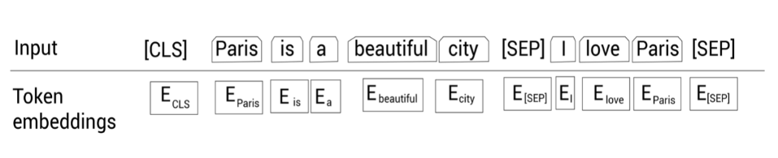

**2.片段嵌入**

其次，我们有一个片段嵌入层。用于区分给定的两个句子。还是考虑上面介绍的例子：
已知上述例子分词后得到：
>tokens=[ [CLS]，Paris，is，a，beautiful，city，[SEP],I，love，Paris，[SEP] ]

然后，除了 [SEP] 标记，我们还要给模型某种标志来区分两个句子。因此，我们将输入的标记喂给片段嵌入层。

片段嵌入层只返回两种嵌入，$E_{A} $或$ E_{B}$，作为输出。即如果输入标记属于句子 A，那么该标记会映射到嵌入$E_{A}$；反之属于句子 B 的话，则映射到嵌入 $E_{B}$

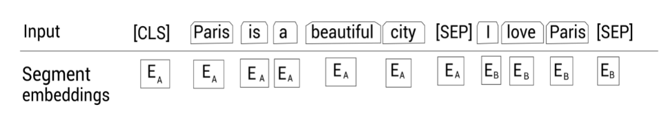

那如果我们只有一个句子时，片段嵌入是如何工作的呢？很简单，假设我们只有一个句子Paris is a beautiful city，那么所有的标记只会映射到同一个嵌入 $E_{A} $：
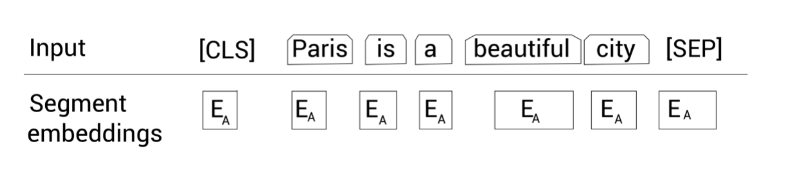

**3.位置嵌入**

接下来，我们有一个位置嵌入层。我们知道 Transformer 为了得到句子中单词的顺序信息，使用了位置编码。

我们也知道 BERT 本质上就是 Transformer 的编码器，所以我们需要提供句子中标记的位置信息，然后才能输入到 BERT。位置嵌入层就是干这个工作的。

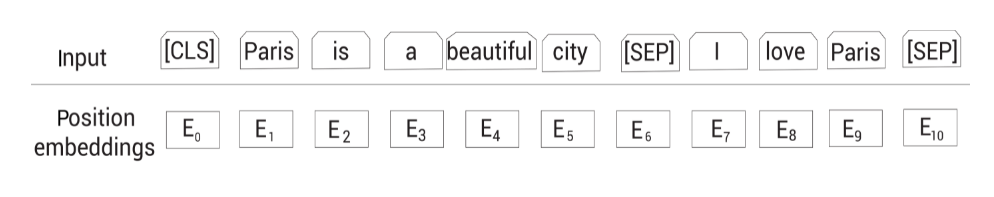

如图所示，$E_0$ 表示标记 [CLS] 的位置嵌入，$E_1$ 表示标记 Paris 的位置嵌入，以此类推。

**最终的表示**

现在我们看一下最终的输入表示是怎样的。如下图所示，首先我们将给定的输入序列分词为标记列表，然后喂给标记嵌入层，片段嵌入层和位置嵌入层，得到对应的嵌入表示。然后，累加所有的嵌入表示作为 BERT 的输入表示。
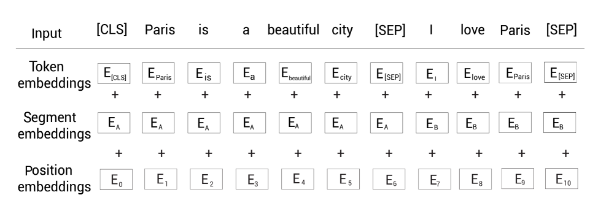
比如标记 [CLS] 的输入表示为$标记嵌入 E_{CLS}$+$片段嵌入 E_A$+$位置嵌入 E_0$。

下面我们来看一下 BERT 使用的叫作 WordPiece 的分词器。
## WordPiece分词器

WordPiece 分词器基于子词（subword）分词模式。还是以一个例子来理解该分词器是如何工作的。
如下句子：
>let us start pretraining the model

现在，如果我们使用 WordPiece 分词器来分词，我们会得到如下所示的标记：
>tokens=[let，us，start，pre，##train，##ing，the，model]

我们可以观察到，在使用 WordPiece 分词器对句子进行分词时，单词 pretraining 被拆分为以下子词——pre、##train、##ing。

这是因为，当使用 WordPiece 分词器分词，首先我们检测单词在词表（vocabulary）中是否存在 ，若存在，则作为标记；否则，我们将该单词拆分为一些子词，然后我们检查这些子词是否存在于词表。

如果某个子词存在于词表，那么将它作为一个标记；否则继续拆分子词，然后检查更小的子词是否存在于词表中。

这样，我们不断地拆分子词，并用词表检查子词，直到碰到单个字符为止。这种做法可以有效地处理未登录词（out-of-vocabulary，OOV）。

BERT 的词表有 30K 个标记，如果某个单词属于这 30K 个标记中一个，那我们将该单词视为一个标记；否则，我们拆分单词为子词，然后检查子词是否属于这 30K 个标记之一。

在我们的例子中，单词 pretraining 不在 BERT 的词表中。一次你，我们将它拆分为子词 pre，##train和##ing。前面的#表示这个单词为一个子词，并且它前面有其他单词。

现在我们检查子词##train和##ing是否出现在词表中。因为它们正好在词表中，所以我们不需要继续拆分。

## 预训练策略
BERT 模型的预训练基于两个任务：

* 屏蔽语言建模
* 下一句预测
在深入屏蔽语言建模之间，我们先来理解一下语言建模任务的原理。

**语言建模**    
在语言建模任务中，我们训练模型给定一系列单词来预测下一个单词。   
可以把语言建模分为两类：

* 自回归语言建模
* 自编码语言建模

**自回归语言建模**     
我们还可以将自回归语言建模归类为：

* 前向(左到右)预测
* 反向(右到左)预测

老规矩，通过实例来理解。考虑文本 Paris is a beautiful city. I love Paris。假设我们移除了单词 city 然后替换为空白符__：
> Paris is a beautiful __. I love Paris

现在，我们的模型需要预测空白符实际的单词。如果使用前向预测，那么我们的模型以从左到右的顺序阅读序列中的单词，直到空白符：
>Paris is a beautiful __.

如果我们使用反向预测，那么我们的模型以从右到左的顺序阅读序列中的单词，直到空白符：
> __. I love Paris

因此，**自回归模型**天然就是单向的，意味着它们只会以一个方向阅读输入序列。

**自编码语言建模：** 自编码语言建模任务同时利用了前向(左到右)和反向(右到左)预测的优势。即，它们在预测时同时读入两个方向的序列。因此，我们可以说自编码语言模型天生就是双向的。

为了预测空白符，自编码语言模型同时从两个方向阅读序列，如下所示：
> Paris is a beautiful __. I love Paris

因此双向的模型能获得更好的结果。

**任务1.屏蔽语言建模**

BERT 是一个自编码语言模型，即预测时同时从两个方向阅读序列。在一个屏蔽语言建模任务中，对于给定的输入序列，我们随机屏蔽 15% 的单词，然后训练模型去预测这些屏蔽的单词。

为了做到这一点，我们的模型以两个方向读入序列然后尝试预测屏蔽的单词。

举个例子。我们考虑上面见到的句子：Paris is a beautiful city.I love Paris.

首先我们对句子分词，并添加标记：
>tokens=[ [CLS]，Paris，is，a，beautiful，city，[SEP],I，love，Paris，[SEP] ]

接下来，我们在上面的标记列表中随机地屏蔽 15% 的标记（单词）。假设我们屏蔽单词 city，然后用 [MASK] 标记替换这个单词，结果为：
>tokens=[ [CLS]，Paris，is，a，beautiful，[MASK]，[SEP],I，love，Paris，[SEP] ]

现在训练我们的 BERT 模型去预测被屏蔽的标记。

这里有一个小问题。以这种方式屏蔽标记会在预训练和微调之间产生差异。即，我们通过预测 [MASK] 标记，训练 BERT 。

训练完之后，我们可以为下游任务微调预训练的 BERT 模型，比如情感分析任务。

但在微调期间，我们的输入不会有任何的 [MASK] 标记。因此，它会导致 BERT 的预训练方式与微调方式不匹配。

为了解决这个问题，我们应用 80-10-10% 规则。只针对句子中这随机屏蔽的15% 的标记，我们做下面的事情：

80% 的概率，我们用 [MASK] 标记替换该标记。因此，80% 的情况下，输入会变成如下：
>tokens=[ [CLS]，Paris，is，a，beautiful，[MASK]，[SEP],I，love，Paris，[SEP] 

10% 的概率，我们用一个随机标记(单词)替换该标记。所以，10% 的情况下，输入变为：
>tokens=[ [CLS]，Paris，is，a，beautiful，love，[SEP],I，love，Paris，[SEP]

剩下 10% 的概率，我们不做任何替换。因此，此时输入不变：
>tokens=[ [CLS]，Paris，is，a，beautiful，city，[SEP],I，love，Paris，[SEP]

在分词和屏蔽之后，我们分别将这些输入标记喂给标记嵌入、片段嵌入和位置嵌入层，然后得到输入嵌入。

然后，我们将输入嵌入喂给 BERT。如下所示，BERT 接收输入然后返回每个标记的嵌入表示作为输出。

$R_{[CLS]} $代表输入标记 [CLS] 的嵌入表示，$R_{Paris}$ 代表标记 Paris 的嵌入表示，以此类推。

在本例中，我们使用 BERT-base，即有 12 个编码器层，12 个注意力头和 768 个隐藏单元。
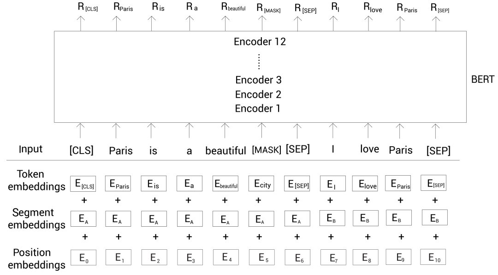

我们得到了每个标记的嵌入表示 R。现在， 我们如何用这些表示预测屏蔽的标记？

为了预测屏蔽的标记，我们将 BERT 返回的屏蔽的单词表示 R [MASK] 喂给一个带有 softmax 激活函数的前馈神经网络。然后该网络输出词表中每个单词属于该屏蔽的单词的概率。

如下图所示，这里输入嵌入层没有画出来以减小版面：
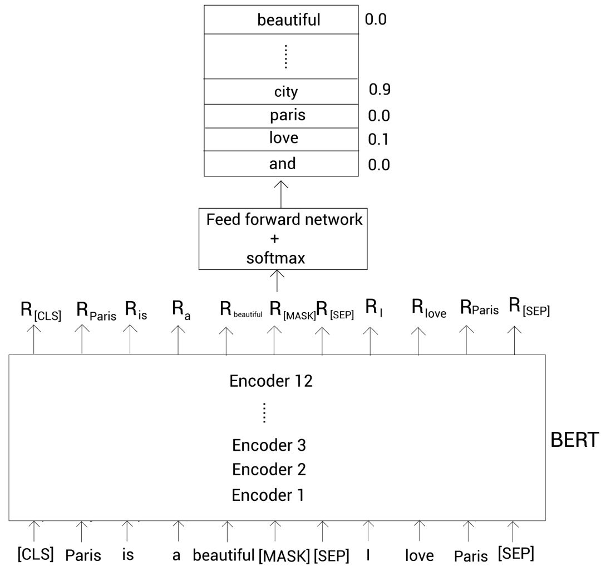

从上图可以看到，单词 city 属于屏蔽单词的概率最高。因此，我们的模型会预测屏蔽单词为 city。

注意在初始的迭代中，我们的模型不会输出正确的概率，因为前馈网络和 BERT 编码器层的参数还没有被优化。

然而，通过一系列的迭代之后，我们更新了前馈网络和 BERT 编码器层的参数，然后学到了优化的参数。

屏蔽语言建模也被称为完形填空（cloze）任务。我们已经知道了如何使用屏蔽语言建模任务训练 BERT 模型。

而屏蔽输入标记时，我们也可以使用一个有点不同的方法，叫作全词屏蔽（whole word masking，WWM）。

**全词屏蔽**

同样，我们以实例来理解全词屏蔽是如何工作的。考虑句子 Let us start pretraining the model。

记住 BERT 使用 WordPiece 分词器，所以，在使用该分词器之后，我们得到下面的标记：
>tokens=[let，us，start，pre，##train，##ing，the，model]

然后增加 [CLS] 和 [SEP] 标记：
>tokens=[[CLS]，let，us，start，pre，##train，##ing，the，model，[SEP]]

接着随机屏蔽 15% 的单词。假设屏蔽后的结果为：
>tokens=[[CLS]，[MASK]，us，start，pre，[MASK]，##ing，the，model，[SEP]]

从上面可知，我们屏蔽了单词 let 和##train。其中##train是单词 pretraining 的一个子词。
**在全词屏蔽模型中，如果子词被屏蔽了，然后我们屏蔽与该子词对应单词的所有子词。**

因此，我们的标记变成了下面的样子:
>tokens=[[CLS]，[MASK]，us，start，[MASK]，[MASK]，[MASK]，the，model，[SEP]]

注意我们也需要保持我们的屏蔽概率为 15%。所以，当屏蔽子词对应的所有单词后，如果超过了 15% 的屏蔽率，我们可以取消屏蔽其他单词。

如下所示，我们取消屏蔽单词 let 来控制屏蔽率：
>tokens=[[CLS]，let，us，start，[MASK]，[MASK]，[MASK]，the，model，[SEP]]

这样，我们使用全词屏蔽来屏蔽标记。


**任务2.下一句预测**

下一句预测（next sentence prediction，NSP）是另一个用于训练 BERT 模型的任务。

NSP 是二分类任务，在此任务中，我们输入两个句子两个 BERT，然后 BERT 需要判断第二个句子是否为第一个句子的下一句。
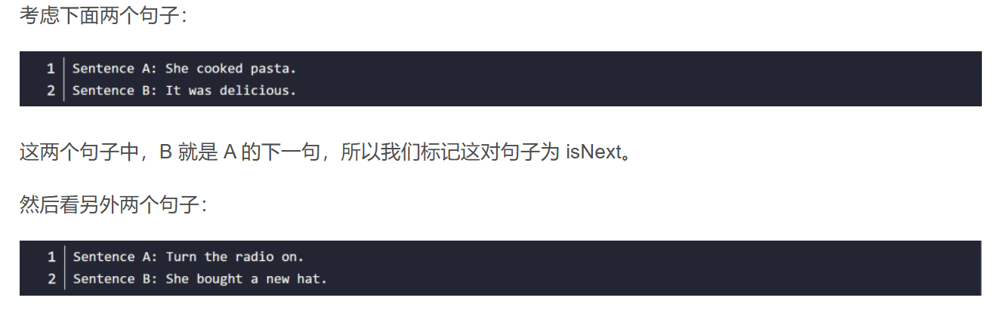

显然 B 不是 A 的下一句，所以我们标记这个句子对为 notNext。

在 NSP 任务中，我们模型的目标是预测句子对属于 isNext 还是 notNext。

那么 NSP 任务有什么用？通过运行 NSP 任务，我们的模型可以理解两个句子之间的关系，这会有利于很多下游任务，像问答和文本生成。

那么如何获取 NSP 任务的数据集？我们可以从任何单语语料库中生成数据集。假设我们有一些文档。

对于 isNext 类别，我们从某篇文档中抽取任意相连的句子，然后将它们标记为 isNext；对于 notNext 类别，我们从一篇文档中取一个句子，然后另一个句子随机的从所有文档中取，标记为 notNext。

同时我们需要保证数据集中 50% 的句子对属于 isNext，剩下 50% 的句子对属于 notNext。

假设我们这样得到如下所示的数据集：
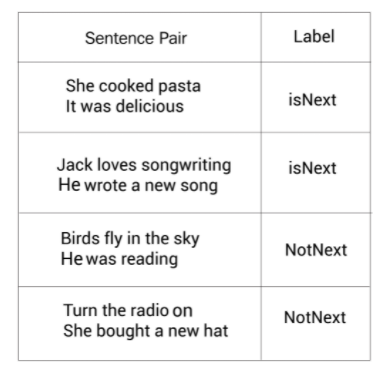

我们以上面数据集中第一个句子对为例。首先，我们进行分词，得到：
>tokens=[She cooked，pasta，It，was，delicious]

接下来，增加 [CLS] 和 [SEP] 标记：
>tokens=[[CLS],She cooked，pasta，[SEP]，It，was，delicious，[SEP]]

然后我们把这个输入标记喂给标记嵌入、片段嵌入和位置嵌入层，得到输入嵌入。接着把输入嵌入喂给 BERT 获得每个标记的嵌入表示。如下图所示，$R_{[CLS]} $代表标记 [CLS] 的嵌入表示。
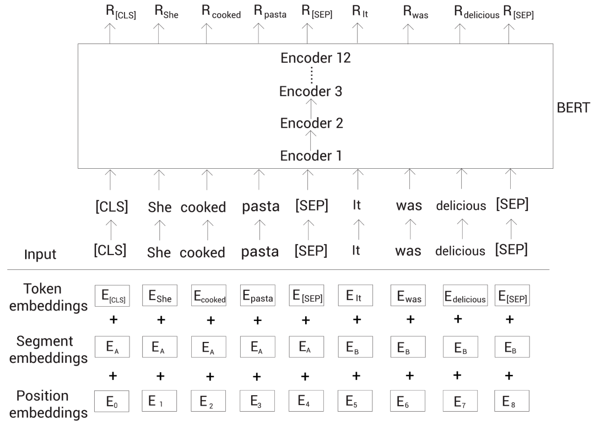

为了进行分类，我们简单地将 [CLS] 标记的嵌入表示喂给一个带有 softmax 函数的全连接网络，该网络会返回我们输入的句子对属于 isNext 和 notNext 的概率。

因为 [CLS] 标记保存了所有标记的聚合表示。也就得到了整个输入的信息。所以我们可以直接拿该标记对应的嵌入表示来进行预测。
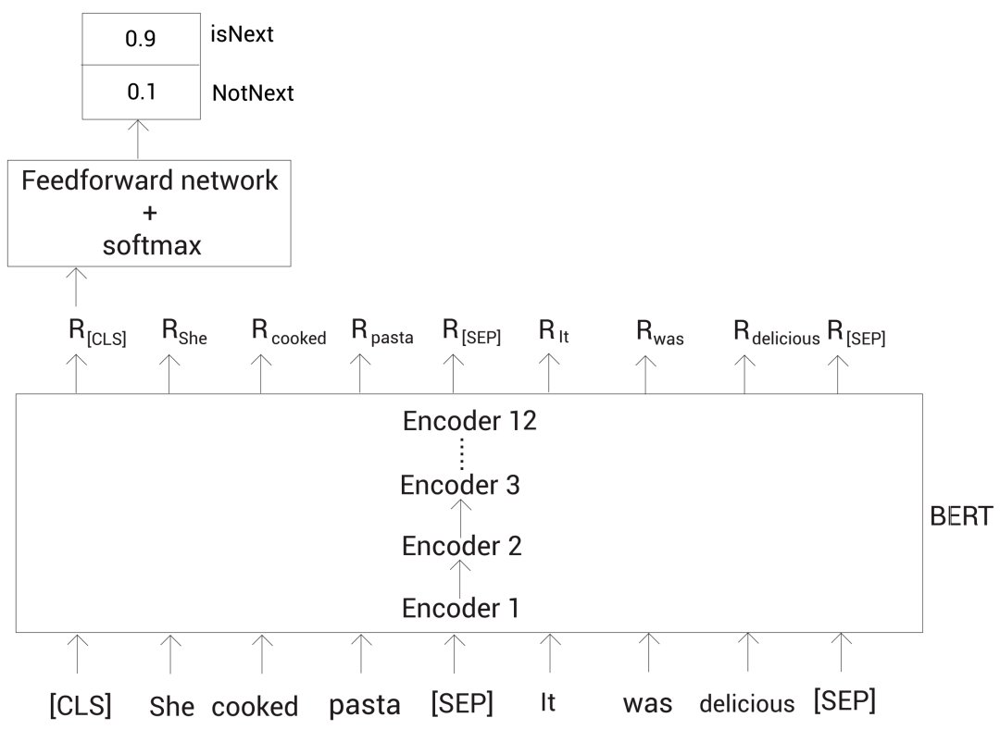
上面我们可以看到，最终的全连接网络输出 isNext 的概率较高。
## 预训练过程
原始论文中的 BERT 是通过 Toronto BookCorpus 和维基百科数据集预训练的。

我们已经知道了 BERT 通过屏蔽语言建模和 NSP 任务进行预训练。那么我们如何为这两个任务准备数据集呢？

首先，我们从语料库中采样两个句子（或文本片段）。假设我们采样了句子 A 和 B，这两个句子的所有分词后的标记总数应该小于等于 512。

在采样两个句子（或文本片段）时 u，50% 的情况下，我们采样点句子 B 为句子 A 的下一句；另外 50% 的情况下，我们采样的句子 B 不是句子 A 的下一句。
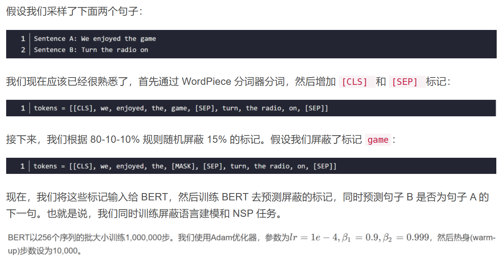

什么是热身步？
在训练的初始阶段，我们可以设置一个很大的学习率，但是我们应该在后面的迭代中设置一个较小的学习率。

因为在初始的迭代时，我们远没有收敛，所以设置较大的学习率带来更大的步长是可以的，但在后面的迭代中，我们已经快要收敛了，如果学习率（导致步长）较大可能会错过收敛位置（极小值）。

在初始迭代期设置较大的学习率而在之后的迭代期减少学习率的做法被称为学习率 scheduling。

热身步就是用于学习率 scheduling 的。假设我们的学习率是 1e-4，然后热身步为 10000 个迭代。

意味着我们在初始的 10000 个迭代中，将学习率从 0 增大到 1e-4。在 10000 个迭代后，我们线性地减少学习率因为我们接近收敛位置了。

我们同样对所有的网络层使用 0.1 的 dropout 比率。BERT 使用的激活函数叫作 GELU（Gaussian Error Linear Unit）。

## 子词Tokenization算法
子词 Tokenization（可以理解为分词）在很多 SOTA NLP 模型上得到广泛的使用，包括 BERT 和 GPT-3。它能很有效的处理未登陆词。

本节我们会探讨子词 Tokenization 的工作细节。在深入之前，我们先看一下单词级的 Tokenization。

假设我们有一个训练数据集。我们从这个训练数据集中构建一个词表。为了构建该词表，我们将数据集中的文本拆分成单词，然后把唯一的单词加入到词表。

通常，词表包含很多单词（标记），为了举例的简单，假设我们的词表只包含下面的单词：
>vocabulary=[game，the，I，played，walked，enjoy]

现在我们有了词表，然后我们基于该词表来对输入进行分词。考虑输入句子 I played the game。

在英文中，我们只要通过空格就得得到句子中所有的单词。所以我们有 [I, play, the, game]。现在，我们检查是否所有的单词都在词表中。

恰好这些单词都在词表中，从给定句子中得到的最终标记就为：
>tokens=[I，played，the，game]

接着我们考虑另一个句子：I enjoyed the game。首先还是根据空格分词，得到 [I, enjoyed, the, game]。

接着，检查是否所有的单词出现在词表中。我们可以看到，除了单词 enjoyed，其他的单词都在词表中，因此我把 enjoyed 替换为未知标记 ，这样我们最终的标记为：
>tokens=[I，[UNK]，the，game]

我们也可以看到，尽管我们词表中有单词 enjoy，但是由于没有完全一样的单词 enjoyed，它就变成未知词了。

可能是因为我们的词表太小了，然而哪怕有一个超大的词表，先不说这样的词表会带来内存和性能方面的压力，仍然有可能无法处理没有出现过的词（词表中也没有出现过）。

那么是否有更好的方式来解决这个问题呢？

这时就需要子词 Tokenization 技术了。我们以上面的例子来看子词 Tokenization 的工作原理，我们的词表包含下面的单词：
>vocabulary=[game，the，I，played，walked，enjoy]

在子词 Tokenization 中，我们将单词拆分为更小的子词。假设我们拆分单词 played 为子词 [play, ed]；拆分单词 walked 为子词 [walk, ed]。

在拆分子词后，我们将这些子词加到词表中。由于词表中不包含重复单词，所以我们的词表变成了：
>vocabulary=[game，the，I，play，walk，ed，enjoy]

让我们考虑之前看到的句子：I enjoyed the game。同样我们先根据空格将句子拆分单词，我们有 [ I, enjoyed, the, game]。

接着我们检测是否所有的单词都在词表中。我们可以看到除了单词 enjoyed，其他所有单词都在词表中。

此时，我们不会将该单词替换为未知词，而是将它继续拆分为子词：[enjoy, ed]。然后我们继续检查这些子词是否出现在词表中，刚好都出现在词表中。

所以我们得到了下面的标记：
>tokens=[ I, enjoy，##ed, the, game]。

我们可以看到 ed 前面有两个#。这代表##ed 是一个子词，而且它前面有另一个单词。

我们不会为单词拆分后的第一个子词增加##符号，这就是为什么子词 enjoy 前面没有#。这样子词 Tokenization 处理了未知词，也就是没有出现在词表中的单词。

现在问题是，我们知道我们将单词 played 和 walked 拆分成子词，然后增加它们的子词到词表中。

但是为什么我们只拆分这些单词呢？为什么不是词表中的其他单词？我们如何决定哪些单词要拆分，哪些不要？这就是子词 Tokenization 算法起作用的地方。

常见的子词 Tokenization 算法：

* 字节对编码（Byte pair encoding，BPE）
* 字节级字节对编码（Byte-level byte pair encoding，BBPE）
* WordPiece

具体算法详解参考:
[原文链接第十节](https://blog.csdn.net/2301_76168381/article/details/149276125)


## 二、RoBERTa概述
RoBERTa全称是Robustly optimized BERT approach，由Facebook（现Meta）在2019年推出。它不像其他模型那样增加花哨的新结构，而是通过训练策略的极致优化，把BERT这个"基础款"发动机调校成了高性能版本。就好比同样的汽车底盘，专业技师通过调整燃油喷射系统和变速箱参数，就能爆发出更强的马力。

它的改进思路并是没有动模型架构，在模型规模、算力和数据上，与BERT相比主要有以下几点改进：

* 更大的模型参数量（论文提供的训练时间来看，模型使用 1024 块 V100 GPU 训练了 1 天的时间）
* 更大bacth size。RoBERTa 在训练过程中使用了更大的bacth size。尝试过从 256 到 8000 不等的bacth size。
* 更多的训练数据（包括：CC-NEWS 等在内的 160GB 纯文本。而最初的BERT使用16GB BookCorpus数据集和英语维基百科进行训练）

RoBERTa建立在BERT的语言掩蔽策略的基础上，修改BERT中的关键超参数，包括删除BERT的下一个句子训练前目标，以及使用更大的bacth size和学习率进行训练。RoBERTa也接受了比BERT多一个数量级的训练，时间更长。这使得RoBERTa表示能够比BERT更好地推广到下游任务。

RoBERTa在训练方法上有以下改进：


* 大胆移除NSP任务（Next Sentence Prediction）
* 把静态掩码升级为动态掩码（Dynamic Masking）
* 采用BBPE分词器（Byte-level BPE）


**动态掩码：** BERT 依赖随机掩码和预测 token。原版的 BERT 实现在数据预处理期间执行一次掩码，得到一个静态掩码。 而 RoBERTa 使用了动态掩码：每次向模型输入一个序列时都会生成新的掩码模式。这样，在大量数据不断输入的过程中，模型会逐渐适应不同的掩码策略，学习不同的语言表征。

**文本编码：** 采用BBPE分词器（Byte-level BPE）是字符级和词级别表征的混合，支持处理自然语言语料库中的众多常见词汇。原版的 BERT 实现使用字符级别的 BPE 词汇，大小为 30K，是在利用启发式分词规则对输入进行预处理之后学得的。Facebook 研究者没有采用这种方式，而是考虑用更大的 byte 级别 BPE 词汇表来训练 BERT，这一词汇表包含 50K 的 subword 单元，且没有对输入作任何额外的预处理或分词。


经过长时间的训练，本文的模型在GLUE排行榜上的得分为88.5分，与Yang等人(2019)报告的88.4分相当。本文模型在GLUE 9个任务的其中4个上达到了state-of-the-art的水平，分别是：MNLI, QNLI, RTE 和 STS-B。此外，RoBERTa还在SQuAD 和 RACE 排行榜上达到了最高分。

## 动态掩码

BERT的原始掩码策略就像老师给学生出填空题：每次训练都用完全相同的题目。比如句子"人工智能改变世界"，总是固定掩码"改变"这个词。模型很快就能记住答案，但遇到新题型就容易懵。

RoBERTa的动态掩码则像智能题库系统。还是同一个句子，第一次可能掩码"人工"，第二次变成"智能"，第三次可能是"世界"。我在本地用PyTorch实现时是这样处理的：
```
def dynamic_masking(text, mask_prob=0.15):
    tokens = tokenizer.tokenize(text)
    masked_indices = random.sample(
        range(len(tokens)), 
        int(len(tokens)*mask_prob)
    )
    return [token if i not in masked_indices else '[MASK]' 
            for i, token in enumerate(tokens)]
```
这种机制带来两个实际好处：

* 数据利用率提升10倍：每个样本会复制10份不同掩码版本
* 防止模型偷懒：迫使模型真正理解上下文关系，而不是记忆固定模式

实际效果:在文本蕴含任务测试中，动态掩码让模型在RTE数据集上的准确率从68.2%提升到了71.5%。特别是在处理长文本时，模型对远距离依赖关系的捕捉明显更精准。这就像学生做过各种变形题后，遇到考试新题也能从容应对。

## 移除NSP

BERT原本设计Next Sentence Prediction（NSP）任务的初衷很好：让模型理解句子间关系。但实际使用中发现，这个任务反而成了拖累。就像让小学生同时学数学和美术，结果两样都学不精。

RoBERTa团队通过严谨实验对比了四种设置：

* 段落对+NSP（原始BERT方式）
* 句子对+NSP
* 跨文档连续句子（去NSP）
* 单文档连续句子（去NSP）

结果令人惊讶：**去掉NSP任务后，模型在各项下游任务中表现更好。** 这就像专业运动员专注主项训练后，成绩反而超过之前的多项训练。

现在RoBERTa采用"FULL-SENTENCES"模式：连续采样句子直到达到512长度，允许跨文档。这种设计：

* 更贴近真实文本分布（文档本来就是连续的）
* 避免人为制造的句子对带来的噪声
* 保留完整的局部上下文信息

在情感分析任务中，这种改进使模型对长文档的情感倾向判断更加一致。在IMDb影评数据集，RoBERTa的连贯性评分比BERT高出7%。

## BBPE分词器：更细粒度的文本理解
1、从WordPiece到字节级BPE   

BERT使用的WordPiece分词器有个痛点：遇到生僻词或拼写变体时容易拆分成无意义的子词。比如"ChatGPT"可能被拆成["Chat", "G", "P", "T"]，丢失语义信息。

RoBERTa采用的BPE（Byte-level BPE）直接从字节层面构建词表：

* 把文本转为UTF-8字节序列
* 应用BPE算法合并高频字节对
* 最终词表扩展到约5万（BERT是3万）

这种设计带来三个实际优势：

* 更好的未知词处理：任何字符都能用字节表示
* 跨语言兼容性：统一处理各种语言的文本
* 更紧凑的嵌入空间：字节级组合比硬编码词表更灵活

2、 分词效果对比

测试"深度学习框架PyTorch"的分词结果：

* BERT：["深", "度", "学", "习", "框", "架", "Py", "##Tor", "##ch"]
* RoBERTa：["深度", "学习", "框架", "PyTorch"]

可以看到RoBERTa的分词结果更接近人类认知。在实际NER任务中，这种改进使实体边界识别准确率提升了2-3%。

## 模型规模提升

1、数据量级的跃升

BERT当初的训练数据是16GB的图书和维基百科文本，而RoBERTa直接扩展到160GB，新增了：

* CC-News（Common Crawl新闻数据）
* OpenWebText（Reddit优质内容）
* Stories（Common Crawl故事类子集）

这就像厨师拥有了更丰富的食材库。我在复现实验时深有体会：当数据量达到阈值后，模型的泛化能力会出现非线性提升。特别是在处理新闻、社交媒体等非正式文本时，RoBERTa的优势更加明显。

2、训练参数的极致优化

RoBERTa把batch size从BERT的256提升到8000，相当于：

* 每次参数更新看到更多样本
* 梯度估计更稳定
* 训练速度反而更快（得益于并行优化）

```
# 典型训练配置对比
training_config = {
    'BERT': {'batch_size': 256, 'steps': 1_000_000},
    'RoBERTa': {'batch_size': 8000, 'steps': 300_000}
}
```
实际训练中发现，大batch size需要配合学习率调整。RoBERTa采用的学习率warmup策略很关键：前期慢慢升温，避免大步更新破坏预训练好的表示。

## RoBERTa实战分享
1、快速上手HuggingFace实现

用transformers库加载RoBERTa只需要几行代码：
```
from transformers import RobertaTokenizer, RobertaForSequenceClassification
import torch
 
tokenizer = RobertaTokenizer.from_pretrained('roberta-base')
model = RobertaForSequenceClassification.from_pretrained('roberta-base')
 
inputs = tokenizer("这是一个分类示例", return_tensors="pt")
outputs = model(**inputs)
predictions = torch.argmax(outputs.logits, dim=-1)
```
这里有个实用技巧：如果显存不足，可以添加gradient_checkpointing=True参数，用计算时间换显存空间。

2、微调

在电商评论情感分析项目中，我总结了这些实战经验：

* 学习率设置：RoBERTa需要更小的学习率（通常3e-5到5e-5）
* 批次大小：尽量保持和预训练时相近的大batch
* 训练轮次：通常3-5个epoch就足够，过拟合风险比BERT低
* 层解冻策略：先只训练分类头，再逐步解冻上层

实测RoBERTa在少样本场景下表现尤其突出。用500条标注数据就能达到BERT用2000条数据的效果，这对标注成本高的任务非常友好。

## 模型选择指南：何时该用RoBERTa
RoBERTa适用场景：

* 长文本理解：动态掩码对文档级任务更有效
* 非正式文本：训练数据包含更多社交媒体、新闻语料
* 少样本学习：强大的预训练表示降低对标注数据依赖
* 多语言任务：BBPE处理混合语言文本更有优势

而在以下情况可能BERT更合适：

* 极度受限的计算资源
* 需要快速原型验证
* 任务与NSP高度相关（很少见）

有个容易忽略的细节：RoBERTa的输入长度仍然是512，但实际有效长度更长，因为去除了NSP占用的位置。在处理长文档时，这个"隐形加成"很实用。

## 三、MacBert概述
MacBERT是由哈工大讯飞联合实验室开发的中文预训练模型，它通过创新的纠错型掩码语言模型技术，有效解决了传统BERT模型在中文处理中的预训练-下游任务不一致问题。

## macbert机制
macbert主要针对mask机制做了优化，此外也验证了SOP（句子顺序预测）任务优于NSP（下一句预测）任务，Macbert优化点主要包含以下

* 随机mask机制采用全词mask
* mask机制为n-gram方式
* 因此使用近义词替换【mask】
* 相比原始bert，使用SOP任务代替了NSP任务

在自然语言处理（NLP）领域，特别是在BERT类预训练语言模型的发展中，SOP任务被证明优于NSP任务。
这一改进主要是为了解决NSP任务存在的一个关键缺陷：任务过于简单，导致模型“作弊”。

NSP与SOP任务对比：

特性	|NSP (下一句预测)	|SOP (句子顺序预测)
---|---|---
正样本	|来自同一文档的相邻句子 (A, B)|	来自同一文档的相邻句子 (A, B)
负样本	|来自不同文档的随机句子 (A, C)	|交换正样本顺序的句子 (B, A)
核心缺陷	|模型可通过判断主题一致性来“作弊”	|无此缺陷
学习目标	|混淆了主题预测和连贯性预测|	专注于学习句子间的连贯性
任务难度|	相对简单	|更具挑战性

实验结果表明，使用SOP任务的模型在需要理解句子关系的下游任务（如自然语言推理、问答等）中，性能显著优于使用NSP任务的模型。因此，SOP成为了对BERT模型进行改进时一个更优的预训练任务选择。

## mask机制策略
从原句中随机筛选15%的词mask，由于下游任务在Fine-tuning过程中并没有【mask】token，因此使用近义词替换【mask】，mask详细策略如下

* 80%用同义词代替；
* 10%用随即词代替；
* 10%保持不变

## N-gram方式的掩码
N-gram方式的掩码（Masking）机制是自然语言处理（NLP）中一种先进的预训练策略，它通过改变传统模型预测单个词元（Token）的方式，来提升模型对语言结构的理解能力。

🧐 什么是N-gram掩码？

要理解N-gram掩码，可以先回顾一下经典的掩码语言模型（如BERT）。BERT在预训练时，会随机将句子中的一些单个词元（Token）替换为[MASK]，然后让模型根据上下文去预测这些被遮住的词元。例如，对于句子“使用语言模型来预测”，BERT可能会将其变为“使用[MASK]模型来预测”。

N-gram掩码的核心思想是：不再只遮住单个词元，而是遮住一个由N个连续词元组成的词组（即N-gram）。这里的“词元”可以是一个字、一个词或一个子词（sub-word），而“N-gram”就是指N个连续的词元。

例如，对于同一个句子“使用语言模型来预测”，N-gram掩码可能会遮住一个双词词组，变成“[MASK] [MASK]来预测”。

🤔 为什么要采用N-gram掩码？

采用N-gram掩码主要为了解决传统单Token掩码的两个主要局限：

1、提升语义完整性

传统的单Token预测是细粒度的，模型需要多次预测才能拼凑出一个完整词或短语的语义。而N-gram掩码是一种粗粒度的策略，它迫使模型将连续的多个词元视为一个整体进行预测。这有助于模型更好地学习和保持短语或实体（如“语言模型”）的语义完整性，而不是将其看作孤立的字符。

2、建模内部依赖关系

当模型预测一个被遮住的N-gram时，它不仅要理解上下文，还要学习这个N-gram内部词元之间的依赖关系。例如，在预测“[MASK] [MASK]”来补全“语言模型”时，模型需要理解“语言”和“模型”这两个词经常一起出现，并且它们之间存在固定的搭配关系。这种方式能更有效地捕捉语言中更复杂的局部联系。

🛠️ 如何实现N-gram掩码？

N-gram掩码的实现方式有多种，其中一种常见且有效的方法是混合不同长度的N-gram进行掩码。

例如，MacBERT模型就采用了这种策略，它在预训练时以不同的概率选择不同长度的词组进行遮蔽：

* 1-gram (单个词): 40%的概率
* 2-gram (双词词组): 30%的概率
* 3-gram (三词词组): 20%的概率
* 4-gram (四词词组): 10%的概率

这种混合策略让模型能够同时学习到不同粒度的语言单元，从单个词到更长的短语，从而获得更全面和鲁棒的语言表示。

总而言之，N-gram掩码通过从预测“点”到预测“块”的转变，让预训练模型能够学习到更丰富、更完整的语言知识，是当前NLP领域提升模型性能的重要技术之一。


## 四、BART概述

BART借鉴BERT的双向编码bidirectional encoder和GPT的left-to-right decoder各自的特点，建立在标准的seq2seq Transformer model的基础之上，BART结构包含了一个encode和一个decode，更适合应用于文本生成场景；相比GPT，也多了双向上下文语境信息。

BART（Bidirectional and Auto-Regressive Transformers）模型使用标准的基于Transformer的序列到序列结构，主要区别在于用GeLU（Gaussian Error Linerar Units）激活函数替换了原始结构中的 ReLU，以及参数根据正态分布进行初始化。BART 结合双向的 Transformer 编码器与单向的自回归Transformer解码器，通过对含有噪声的输入文本去噪重构进行预训练，是一种典型的 去噪自编码器 （Denoising autoencoder）。BART模型的基本结构如下图所示。
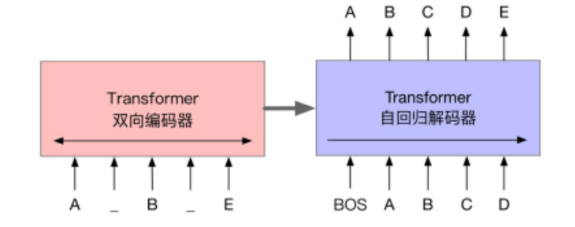
BART的预训练过程可以概括为以下两个阶段。首先，在输入文本中引入噪声，并使用双向编码器编码扰乱后的文本；然后，使用单向的自回归解码器重构原始文本。需要注意的是，编码器的最后一层隐含层表示会作为“记忆”参与解码器每一层的计算。BART模型考虑了多种不同的噪声引入方式，其中包括BERT模型使用的单词掩码。需要注意的是，BERT模型是独立地预测掩码位置的词，而BART模型是通过自回归的方式顺序地生成。  除此之外，BART模型也适用于任意其他形式的文本噪声。

## BART 的核心思想
双向编码 + 自回归解码

**传统模型的局限性**
* BERT：基于 Transformer 编码器，擅长理解文本，但无法直接生成文本
* GPT：基于 Transformer 解码器，擅长生成文本，但只能单向处理上下文

**BART 的创新点**

BART 采用Encoder-Decoder 架构，结合了两者的优势：

* 双向编码器：像 BERT 一样，同时处理文本的前后文信息
* 自回归解码器：像 GPT 一样，逐个生成输出 tokens

这种设计使 BART 既能理解文本的深层语义，又能生成连贯、高质量的文本。

## 技术原理：从预训练到微调

1.预训练任务：文本损坏与重建

BART 的预训练过程可以概括为：先损坏文本，再重建文本。具体通过以下方式实现：

* Token Masking：随机替换文本中的部分 tokens 为特殊的 [MASK] 标记
* Token Deletion：随机删除文本中的某些 tokens
* Text Infilling：在文本中随机插入特殊标记，模型需要预测插入的内容
* Sentence Permutation：随机打乱文本中句子的顺序
* Document Rotation：随机选择一个 token 作为起始点，旋转整个文本

通过这些任务，BART 学会了理解文本的语义结构，并能够从损坏的输入中重建原始文本。

2.微调阶段：适应不同 NLP 任务

在微调阶段，BART 可以通过简单的调整适应各种 NLP 任务：

* 文本生成：直接使用 Encoder-Decoder 结构生成目标文本
* 文本分类：使用编码器的输出，添加分类头进行分类
* 问答系统：编码器处理问题和上下文，解码器生成答案
* 机器翻译：编码器处理源语言文本，解码器生成目标语言文本

[BART参考](https://blog.csdn.net/weixin_45684362/article/details/130161755)