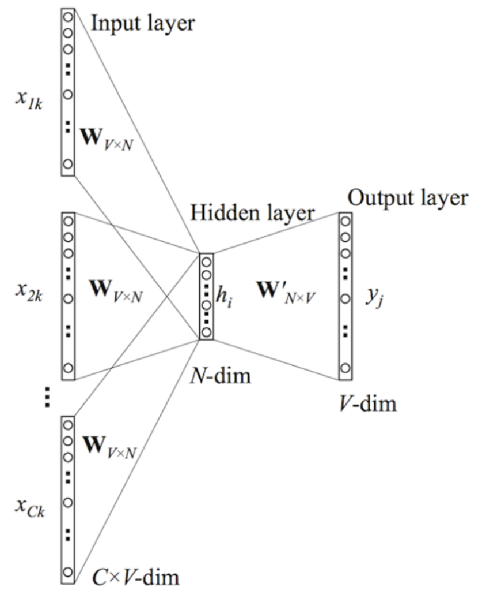
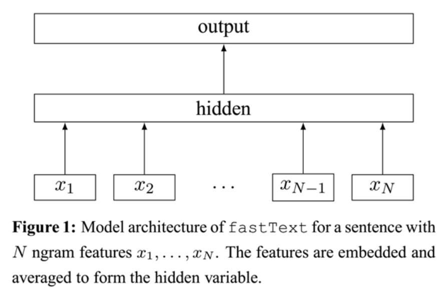

# FastText

FastText是大神Tomas Mikolov在2016年开发的一个高效文本分类和词向量训练库。算是Word2Vec的“弟弟”（出生更晚，性能更高）。其主要优势包括：  
* 训练速度快：比传统深度学习模型快几个数量级
* 支持大规模数据：可处理数十亿词汇级别的语料
* 内置文本预处理：自动处理n-gram特征
* 资源消耗低：适合在普通硬件上运行

## 预备知识
### softmax和分层softmax
[softmax和分层softmax](https://zhuanlan.zhihu.com/p/612506559)
### N-gram
N-gram 是自然语言处理（NLP）中的一个重要概念，主要用于文本分析和语言模型。它的基本思想是将文本分割成长度为N的连续片段（即n-gram），以便进行统计分析和概率计算。[n-gram](https://cloud.tencent.com/developer/article/2632676)可以用于多种NLP任务，如文本生成、语言模型、文本分类和拼写纠错等。通过统计频率，n-gram模型能够评估句子的合理性，并为更复杂的模型提供基础。


##  word2vec

以word2vec的CBOW模型为例，因为它的架构和fastText模型非常相似。于是，你看到facebook开源的fastText工具不仅实现了fastText文本分类工具，还实现了快速词向量训练工具。word2vec主要有两种模型：skip-gram 模型和CBOW模型，这里只介绍CBOW模型，有关skip-gram模型的内容请参考[https://mp.weixin.qq.com/s/reT4lAjwo4fHV4ctR9zbx](https://mp.weixin.qq.com/s/reT4lAjwo4fHV4ctR9zbx)


**模型架构:**


输入层由目标词汇y的上下文单词${x_1，...x_c}$组成，$x_i$ 是被onehot编码过的V维向量，其中V是词汇量；隐含层是N维向量h；输出层是被onehot编码过的目标词y。输入向量通过 $V*N$ 维的权重矩阵W连接到隐含层；隐含层通过  $N*V$ 维的权重矩阵$W'$连接到输出层。因为词库V往往非常大，使用标准的softmax计算相当耗时，于是CBOW的输出层采用的正是上文提到过的分层Softmax。


## fastText分类
这里有一点需要特别注意，一般情况下，使用fastText进行文本分类的同时也会产生词的embedding，即embedding是fastText分类的产物。除非你决定使用预训练的embedding来训练fastText分类模型，这另当别论。

**字符级别的n-gram**

word2vec把语料库中的每个单词当成原子的，它会为每个单词生成一个向量。这忽略了单词内部的形态特征，比如：“apple” 和“apples”，“达观数据”和“达观”，这两个例子中，两个单词都有较多公共字符，即它们的内部形态类似，但是在传统的word2vec中，这种单词内部形态信息因为它们被转换成不同的id丢失了。
为了克服这个问题，fastText使用了字符级别的n-grams来表示一个单词。对于单词“apple”，假设n的取值为3，则它的trigram有：
>“<ap”, “app”, “ppl”, “ple”, “le>”

其中，<表示前缀，>表示后缀。于是，我们可以用这些trigram来表示“apple”这个单词，进一步，我们可以用这5个trigram的向量叠加来表示“apple”的词向量。

**这带来两点好处：**

1. 对于低频词生成的词向量效果会更好。因为它们的n-gram可以和其它词共享。

2. 对于训练词库之外的单词，仍然可以构建它们的词向量。我们可以叠加它们的字符级n-gram向量。

**模型架构**


注意：此架构图没有展示词向量的训练过程。可以看到，和CBOW一样，fastText模型也只有三层：输入层、隐含层、输出层（Hierarchical Softmax），输入都是多个经向量表示的单词，输出都是一个特定的target，隐含层都是对多个词向量的叠加平均。不同的是，CBOW的输入是目标单词的上下文，fastText的输入是多个单词及其n-gram特征，这些特征用来表示单个文档；CBOW的输入单词被onehot编码过，fastText的输入特征是被embedding过；CBOW的输出是目标词汇，fastText的输出是文档对应的类标。


值得注意的是，fastText在输入时，将单词的字符级别的n-gram向量作为额外的特征；在输出时，fastText采用了分层Softmax，大大降低了模型训练时间。这两个知识点在前文中已经讲过，这里不再赘述。


fastText相关公式的推导和CBOW非常类似，这里也不展开了。

**核心思想**

仔细观察模型的后半部分，即从隐含层输出到输出层输出，会发现它就是一个softmax线性多类别分类器，分类器的输入是一个用来表征当前文档的向量；模型的前半部分，即从输入层输入到隐含层输出部分，主要在做一件事情：生成用来表征文档的向量。那么它是如何做的呢？叠加构成这篇文档的所有词及n-gram的词向量，然后取平均。叠加词向量背后的思想就是传统的词袋法，即将文档看成一个由词构成的集合。


于是fastText的核心思想就是：将整篇文档的词及n-gram向量叠加平均得到文档向量，然后使用文档向量做softmax多分类。这中间涉及到两个技巧：字符级n-gram特征的引入以及分层Softmax分类。

**分类效果**

为何fastText的分类效果常常不输于传统的非线性分类器？


假设我们有两段文本：

>我 来到 达观数据    
俺 去了 达而观信息科技


这两段文本意思几乎一模一样，如果要分类，肯定要分到同一个类中去。但在传统的分类器中，用来表征这两段文本的向量可能差距非常大。传统的文本分类中，你需要计算出每个词的权重，比如tfidf值， “我”和“俺” 算出的tfidf值相差可能会比较大，其它词类似，于是，VSM（向量空间模型）中用来表征这两段文本的文本向量差别可能比较大。但是fastText就不一样了，它是用单词的embedding叠加获得的文档向量，词向量的重要特点就是向量的距离可以用来衡量单词间的语义相似程度，于是，在fastText模型中，这两段文本的向量应该是非常相似的，于是，它们很大概率会被分到同一个类中。


使用词embedding而非词本身作为特征，这是fastText效果好的一个原因；另一个原因就是字符级n-gram特征的引入对分类效果会有一些提升 。
## 代码
### 数据清洗

FastText要求输入数据格式为：__label__<标签> <文本内容>。以下是将原始CSV数据转换为FastText格式的代码：
```
import csv

def process_to_fasttext(input_file, output_file):
with open(input_file, 'r', encoding='utf-8') as infile, open(output_file, 'w', encoding='utf-8') as outfile:
csv_reader = csv.reader(infile)
for row in csv_reader:
if len(row) >= 2:
text = row[0].strip()
sentiment = row[1].strip()
label = '__label__positive' if sentiment == '1' else '__label__negative'
outfile.write(f"{label} {text}\n")
```

### 模型训练

使用FastText的train_supervised方法进行模型训练。以下是训练代码示例：
```
import fasttext

model = fasttext.train_supervised(
input="fasttext_train.txt",
lr=0.05,
epoch=100,
wordNgrams=2,
dim=128,
loss='softmax',
minn=3,
maxn=6,
thread=8
)
model.save_model("fasttext_model.bin")
```
### 模型评估

FastText提供了内置的test方法来评估模型性能，包括准确率、召回率和F1分数：
```
result = model.test("fasttext_test.txt")
print(f"测试样本数: {result[0]}")
print(f"准确率: {result[1]:.4f}")
print(f"召回率: {result[2]:.4f}")
```
### 示例预测

可以使用训练好的模型对新文本进行预测：
```
labels, probabilities = model.predict("我很喜欢这家餐厅的服务")
print(f"预测标签: {labels[0]}, 置信度: {probabilities[0]:.4f}")
```
## fastText的应用


fastText作为诞生不久的词向量训练、文本分类工具，在达观得到了比较深入的应用。主要被用在以下两个系统：

1. 同近义词挖掘。Facebook开源的fastText工具也实现了词向量的训练，达观基于各种垂直领域的语料，使用其挖掘出一批同近义词；

2. 文本分类系统。在类标数、数据量都比较大时，达观会选择fastText 来做文本分类，以实现快速训练预测、节省内存的目的。
优化与应用场景

3. 智能客服系统：识别用户意图，提升交互效率。

4. 情感分析：分析用户评论的情绪倾向。

5. 电商平台：对用户查询进行分类，优化搜索体验。

优化方向包括数据增强（如同义词替换）、超参数调优（如调整学习率、n-gram范围）以及模型压缩（适配移动端）。

## 总结

FastText以其高效性和易用性，为中文文本分类提供了强大的解决方案。通过合理的数据预处理和参数调优，开发者可以快速构建高性能的分类模型，广泛应用于智能客服、情感分析等领域。

## 参考
[FastText实战项目](https://developer.aliyun.com/article/1675428)

[N-gram](https://cloud.tencent.com/developer/article/2632676)

[fastText词向量和文本分类代码](https://blog.csdn.net/PolarisRisingWar/article/details/125442854)