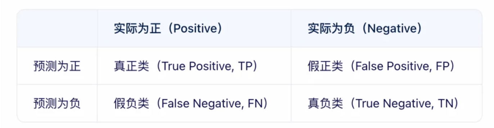

# 多分类问题中的宏F1(Macro-F1)和微F1(Micro-F1)

## 简介
　在多分类问题中，F1 值是一个重要的性能评估指标，用于衡量模型的精度和召回率。它可以通过不同的方式进行计算，这里主要介绍宏 F1（Macro-F1）和微 F1（Micro-F1）。

　　F1-score：是统计学中用来衡量二分类模型精确度的一种指标，用于测量不均衡数据的精度。它同时兼顾了分类模型的精确率和召回率。F1-score可以看作是模型精确率和召回率的一种加权平均，它的最大值是1，最小值是0。

## 精确率、召回率和准确率

* 真正例（True Positive，TP）：预测类别为正例，实际是正例，预测对了目标样本。 

* 假正例（False Positive，FP）：预测类别为正例，实际是负例，预测是目标，但预测错了。

* 假负例（False Negative，FN）：预测类别为负例，实际是正例，没预测出来的目标样本。 

* 真负例（True Negative，TN）：预测类别为负例，实际是负例，。

**１、精确率（Precision）** 是指在所有被模型预测为正类的样本中，实际为正类的比例。它衡量的是模型预测的准确性。

　　Precision（精确率）：被认为正的样本中，实际上有多少是正的。
$$Precision=\frac{TP}{TP+FP}$$

　　该指标用于衡量：在预测出来为正的样本中，有多少是正确预测的。

**２、召回率（Recall）** 是指在所有实际为正类的样本中，被模型正确预测为正类的比例。它衡量的是模型找出所有正类的能力。

　　原本为正的样本中，有多少被找出来了。
$$Recall=\frac{TP}{TP+FN}$$

　　该指标用于衡量：在样本空间中实际为正的样本中，有多少被正确预测出来。

**３、准确率（Accuracy）** 对整个样本空间中的样本分类正确的一个比例。
$$Accuracy=\frac{TP+TN}{TP+FP+TN+FN}$$

**4、F1值的定义**

F1值是精确率和召回率的调和平均数。它的计算公式如下：

$$F1=2*\frac{Precision*Recall}{Precision+Recall}$$

　　当精确率和召回率都非常高时，F1值也会接近于1，这是理想情况。相反，如果其中一个值很低，那么F1值也会受到影响，趋向于较低的数值。
## Macro-F1（宏观F1）
macro f1需要先计算出每一个类别的精确率、召回率及其f1 score，然后通过求均值得到在整个样本上的f1 score。

第 i 类的Precision和Recall可以表示为：
$$Precision_i=\frac{TP_i}{TP_i+FP_i}$$
$$Recall_i=\frac{TP_i}{TP_i+FN_i}$$

**Macro-F1计算方式：**

（1）对各类别的Precision和Recall求平均：
$$Precision_{macro}=\frac{\sum_{i=1}^nPrecision_i}{n}$$
$$Recall_{macro}=\frac{\sum_{i=1}^nRecall_i}{n}$$

（2）然后利用F1计算公式计算出来的F1值即为Macro-F1。
$$F1=2*\frac{Precision_{macro}*Recall_{macro}}{Precision_{macro}+Recall_{macro}}$$

因为对各类别的Precision和Recall求了平均，所以并没有考虑到数据数量的问题。在这种情况下，Precision和Recall较高的类别对F1的影响会较大。

## Micro-F1（微观F1）
micro f1不需要区分类别，直接使用总体样本的精确率和召回率计算f1 score。
micro f1不需要区分类别，直接使用总体样本的准召计算f1 score。

第 i 类的Precision和Recall可以表示为：
$$Precision_i=\frac{TP_i}{TP_i+FP_i}$$
$$Recall_i=\frac{TP_i}{TP_i+FN_i}$$

**Micro-F1计算方法：**

1、先计算出所有类别的总的Precision和Recall
$$Precision_{micro}=\frac{\sum_{i=1}^nTP_i}{\sum_{i=1}^nTP_i+\sum_{i=1}^nFP_i}$$
$$Recall_{micro}=\frac{\sum_{i=1}^nTP_i}{\sum_{i=1}^nTP_i+\sum_{i=1}^nFN_i}$$

2、然后利用F1计算公式计算出来的F1值即为Micro-F1

$$F1=2*\frac{Precision_{micro}*Recall_{micro}}{Precision_{micro}+Recall_{micro}}$$

因为其考虑了各种类别的数量，所以更适用于数据分布不平衡的情况。在这种情况下，数量较多的类别对F1的影响会较大。


## 宏F1与微F1对比


**宏F1（Macro-F1）**

计算方式：先分别计算每个类别的F1分数，再对所有类别取算术平均。

特点：平等对待每个类别，不考虑类别样本数量差异，因此在类别不平衡时能更好反映小样本类别的性能。

适用场景：类别不均衡且每个类别同等重要，例如医疗诊断中罕见病检测。

**微F1（Micro-F1）**

计算方式：将所有类别的TP、FP、FN累加后计算整体的Precision与Recall，再求F1分数。

特点：考虑类别样本数量，结果更受大样本类别影响。在多分类中，Micro-F1 与 Accuracy 数值相等，因为它们都计算了整体正确分类比例。

适用场景：类别分布接近真实比例，且更关注整体预测效果，例如新闻分类。

**示例代码（sklearn）：**
```
from sklearn.metrics import f1_score

y_true = [0, 0, 1, 1, 2, 2, 2]
y_pred = [0, 1, 1, 1, 0, 2, 2]

macro_f1 = f1_score(y_true, y_pred, average='macro')
micro_f1 = f1_score(y_true, y_pred, average='micro')

print(f"Macro-F1: {macro_f1:.4f}")
print(f"Micro-F1: {micro_f1:.4f}")
```

**选择建议：**

Macro-F1：样本不均衡，且各个类别同等重要的情况，可保障小样本的性能  

Micro-F1：注重样本真实分布，只考虑全局效果 

在类别极度不均衡时，Macro-F1 能避免大类掩盖小类性能，而 Micro-F1 更贴近实际总体表现

## 参考
https://zhuanlan.zhihu.com/p/5294724225