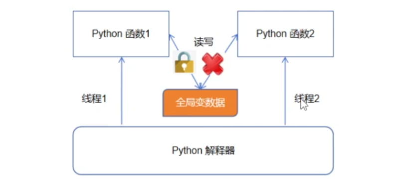

# Python的全局解释器锁（GIL）
## 前言
在Python中，全局解释器锁（Global Interpreter Lock，简称GIL）是一个重要的概念，它对Python解释器的并发执行模型产生了重大影响。


## 什么是GIL

GIL是Python解释器中的一个互斥锁，它确保在同一时刻只有一个线程能够执行Python字节码。这意味着在多线程环境下，Python解释器无法同时利用多个CPU核心进行并行执行，因为只有一个线程能够执行Python字节码指令。


如上图：当Python解释器的线程执行任务函数1时，会共享资源加锁，当函数执行完毕、或者发生IO阻塞等待时，才会释放这把锁。与此同时，由于全局数据被加锁，导致线程2无法拿到全局数据的使用权，则没办法执行任务2。所以，因为这把锁的存在，导致多线程并不能真正的实现多个任务函数并行，而是交替执行的。这个互斥锁就是所谓的GIL。


## GIL的工作原理
当Python解释器运行Python代码时，它会获取GIL，然后执行相应的字节码指令。其他线程想要执行Python字节码时，必须先获取GIL，但只有在当前线程释放GIL后才能获得。因此，只有一个线程能够在任意时刻执行Python字节码，这就是GIL的工作原理。

## GIL的影响
我们先要知道Python解释器本身就是一个C程序，Python代码是由这个C程序来解释执行的。


**多线程：**   
* 尽管Python完全支持多线程编程， 但是解释器的C语言实现部分在完全并行执行时并不是线程安全的。 实际上，解释器被一个全局解释器锁保护着，它确保任何时候都只有一个Python线程执行。 GIL最大的问题就是Python的多线程程序并不能利用多核CPU的优势 （比如一个使用了多个线程的计算密集型程序只会在一个单CPU上面运行）。
* 有一点要强调的是GIL只会影响到那些严重依赖CPU的程序（比如计算型的）。 如果你的程序大部分只会涉及到I/O，比如网络交互，那么使用多线程就很合适， 因为它们大部分时间都在等待。
* 对于依赖CPU的程序，你需要弄清楚执行的计算的特点。 例如，优化底层算法可能要比使用多线程运行快得多。 类似的，由于Python是解释执行的，如果你将那些性能瓶颈代码移到一个C语言扩展模块中， 速度也会提升的很快。如果你要操作数组，那么使用NumPy这样的扩展会非常的高效。 最后，你还可以考虑下其他可选实现方案，比如PyPy，它通过一个JIT编译器来优化执行效率。

**多进程：**
* 在 Python 中，GIL（全局解释器锁）只影响到了多线程，而不会对多进程产生直接的影响。多进程是通过创建不同的 Python 解释器来实现的，因此每个进程都有自己的独立 GIL，它们之间互不影响。

## 如何解决 GIL 的缺点

实例如何优化下述代码：
```
# 执行大量计算（CPU 密集型）
def some_work(args):
    ...
    return result

# 一个调用上述函数的线程
def some_thread():
    while True:
        ...
        r = some_work(args)
    ...
```
**方法一：使用多进程的方式**     
如果你完全工作于Python环境中，你可以使用 multiprocessing 模块来创建一个进程池， 并像协同处理器一样的使用它，每个进程有独立的 GIL。
```
# Processing pool (see below for initiazation)
pool = None

# 执行一个大型计算（CPU 密集型）
def some_work(args):
    ...
    return result

# 一个调用上述函数的线程
def some_thread():
    while True:
        ...
        r = pool.apply(some_work, (args))
        ...

# Initiaze the pool
if __name__ == '__main__':
    import multiprocessing
    pool = multiprocessing.Pool()
```
**方法二：使用C扩展编程技术**      
主要思想是将计算密集型任务转移给C，跟Python独立，在工作的时候在C代码中释放GIL。 可以通过在C代码中插入下面这样的特殊宏来完成:
```
#include "Python.h"
...

PyObject *pyfunc(PyObject *self, PyObject *args) {
   ...
   Py_BEGIN_ALLOW_THREADS
   // Threaded C code
   ...
   Py_END_ALLOW_THREADS
   ...
}
```
如果使用其他工具访问C语言，比如对于Cython的ctypes库，你不需要做任何事。 例如，ctypes在调用C时会自动释放GIL。

[bilibili参考视频](https://www.bilibili.com/video/BV1hJ4m1777G/?spm_id_from=333.337.search-card.all.click&vd_source=c52c527d1d8e9616ff7cba7e37e63fa4)